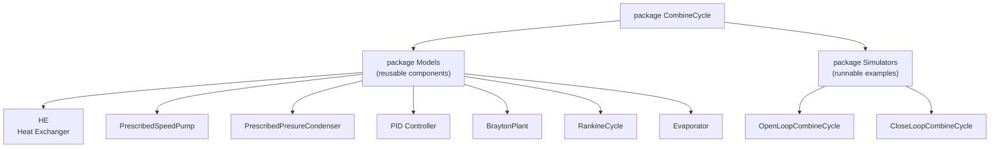
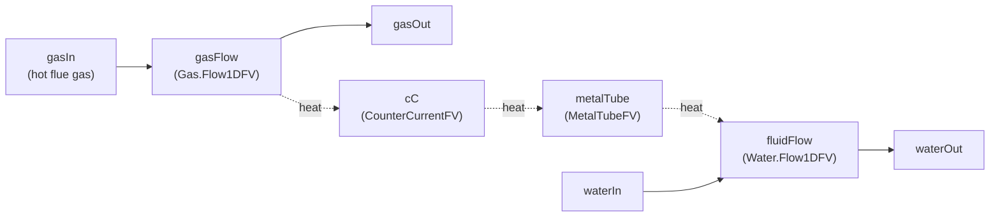
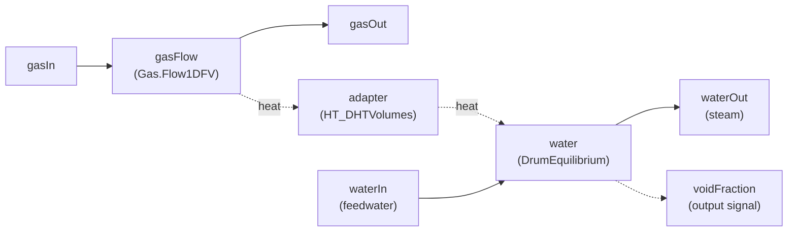
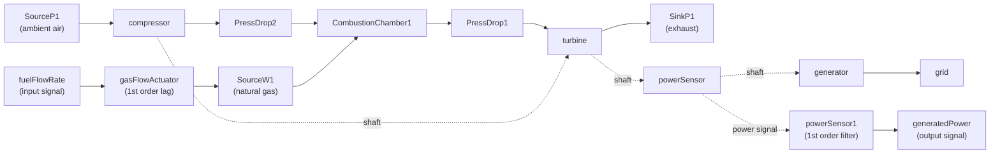
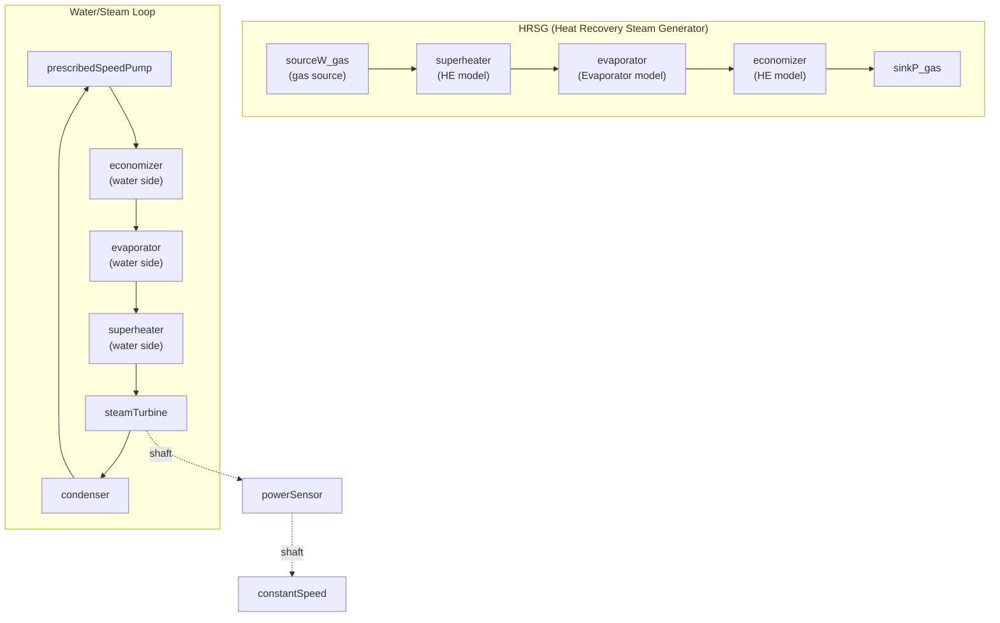
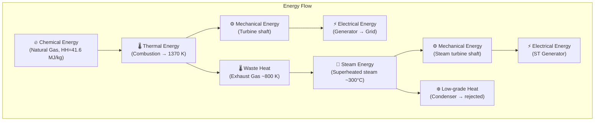

# CombineCycle.mo — Complete Structural Explanation

This document explains every model inside [CombineCycle.mo](file:///c:/Users/user/OneDrive/Documents/CCGT_OpenModelica-main%20-%20Copy/CCGT_OpenModelica-main%20-%20Copy/ThermoPower/ThermoPower/CombineCycle.mo), what each parameter means, and how all the pieces connect to form a **Combined-Cycle Gas Turbine (CCGT) power plant**.

---

## Overall File Structure



The file is divided into two sub-packages:
- **`Models`** — Reusable component models (the building blocks).
- **`Simulators`** — Complete system-level models that wire components together and can be simulated.

---

## Package `Models` — The Building Blocks

---

### 1. `HE` — Heat Exchanger (Gas-to-Fluid)
**Lines 9–94** | Used as: **Economizer** and **Superheater** in the HRSG

This is a counter-current shell-and-tube heat exchanger that transfers heat from hot flue gas to water/steam.

#### Internal Architecture


#### Parameters Explained

| Parameter | Type | Meaning |
|-----------|------|---------|
| `N_G` | Integer | **Number of finite-volume nodes on the gas side.** More nodes = more spatial accuracy but slower simulation. |
| `N_F` | Integer | **Number of finite-volume nodes on the fluid (water) side.** |
| `gasNomFlowRate` | kg/s | **Nominal mass flow rate of flue gas.** Used to size friction and heat transfer correlations. |
| `fluidNomFlowRate` | kg/s | **Nominal mass flow rate of water/steam.** |
| `gasNomPressure` | Pa | **Nominal gas-side inlet pressure.** Used for initial conditions and friction calculation. |
| `fluidNomPressure` | Pa | **Nominal fluid-side inlet pressure.** |
| `exchSurface_G` | m² | **Heat exchange area on the gas side** (outer surface of the tubes seen by the gas). |
| `exchSurface_F` | m² | **Heat exchange area on the fluid side** (inner surface of the tubes seen by the water). |
| `extSurfaceTub` | m² | **Total external surface of the tubes** (used to compute metal wall geometry). |
| `gasVol` | m³ | **Total gas-side volume** inside the heat exchanger shell. |
| `fluidVol` | m³ | **Total fluid-side volume** inside the tubes. |
| `metalVol` | m³ | **Volume of the metal tube walls.** Determines thermal inertia of the wall. |
| `rhomcm` | J/(m³·K) | **Volumetric heat capacity of the metal** = density × specific heat. Controls how fast the wall heats/cools. |
| `lambda` | W/(m·K) | **Thermal conductivity of the tube metal.** Determines conduction resistance through the wall. |
| `gamma_G` | W/(m²·K) | **Constant convective heat transfer coefficient on the gas side.** |
| `gamma_F` | W/(m²·K) | **Constant convective heat transfer coefficient on the fluid side.** |
| `Tstart_G` | K | **Initial average gas temperature** for starting the simulation. |
| `Tstart_M` | K | **Initial average metal wall temperature.** |
| `FluidPhaseStart` | Enum | **Starting phase of the fluid** — Liquid (economizer) or Steam (superheater). |
| `FFtype_G`, `FFtype_F` | Enum | **Friction factor type** (NoFriction, OpPoint, Kfnom, etc.). Determines how pressure drop is calculated. |
| `dpnom_G`, `dpnom_F` | Pa | **Nominal pressure drop** (gas/fluid side) used when FFtype = OpPoint. |
| `rhonom_G`, `rhonom_F` | kg/m³ | **Nominal density** used in friction correlations. |
| `Kfnom_G`, `Kfnom_F` | — | **Nominal hydraulic resistance coefficient** used when FFtype = Kfnom. |
| `counterCurrent` | Boolean | If `true`, gas and fluid flow in opposite directions (standard for heat exchangers). |
| `gasQuasiStatic` | Boolean | If `true`, removes gas-side dynamics (mass/energy storage become algebraic). Speeds up simulation. |

> [!TIP]
> The tube geometry (length, diameter, flow area) is **derived** from `exchSurface_F`, `fluidVol`, and `extSurfaceTub` using circular cross-section formulas—you don't set the tube length directly.

---

### 2. `Evaporator` — Drum-Type Boiler
**Lines 508–643**

A fire-tube boiler with a **drum equilibrium model** on the water side. Unlike the `HE`, this component models two-phase water (liquid + steam coexisting in a drum) and outputs the void fraction.

#### Internal Architecture


#### Parameters Explained

| Parameter | Type | Meaning |
|-----------|------|---------|
| `N` | Integer | **Number of gas-side finite-volume nodes.** |
| `gasNomFlowRate` | kg/s | Nominal gas mass flow rate. |
| `fluidNomFlowRate` | kg/s | Nominal water mass flow rate. |
| `gasNomPressure` | Pa | Nominal gas-side pressure. |
| `fluidNomPressure` | Pa | Nominal water-side pressure. Sets the saturation temperature of the drum. |
| `exchSurface` | m² | **Combined heat exchange surface** between gas and drum. |
| `gasVol` | m³ | Gas-side volume. |
| `fluidVol` | m³ | Total drum water volume (liquid + steam space). |
| `metalVol` | m³ | Metal wall volume. |
| `rhom` | kg/m³ | **Metal density** (e.g., 7900 for steel). |
| `cm` | J/(kg·K) | **Metal specific heat capacity** (e.g., 578.05 for steel). |
| `gamma` | W/(m²·K) | **Overall heat transfer coefficient** from gas to drum wall. |
| `Tstart` | K | Initial average gas temperature. |
| `FFtype_G` | Enum | Gas-side friction factor type. |
| `dpnom_G` | Pa | Nominal gas-side pressure drop. |
| `rhonom_G` | kg/m³ | Nominal gas-side density. |

> [!IMPORTANT]
> The **void fraction output** (`voidFraction = Vv / Vd`) is the ratio of steam volume to total drum volume. This is the **key control variable** used by the pump speed controller to maintain drum water level.

---

### 3. `PrescribedSpeedPump`
**Lines 96–133**

A centrifugal pump whose speed is set by an external signal. It follows a quadratic head-vs-flow characteristic.

#### Parameters Explained

| Parameter | Type | Meaning |
|-----------|------|---------|
| `q_nom[3]` | m³/s | **Three nominal volume flow rate points** defining the pump curve (e.g., `{0, 0.055, 0.1}`). |
| `head_nom[3]` | m | **Three nominal head values** corresponding to `q_nom` (e.g., `{450, 300, 0}`). Together they define a parabolic Q-H curve. |
| `rho0` | kg/m³ | **Reference fluid density** at design conditions (1000 for water). |
| `n0` | rpm | **Nominal pump speed** (1500 rpm). Affinity laws scale the curve with actual speed. |
| `nominalOutletPressure` | Pa | Nominal discharge pressure — used for initialization only. |
| `nominalInletPressure` | Pa | Nominal suction pressure — used for initialization only. |
| `nominalMassFlowRate` | kg/s | Nominal mass flow — used for initialization only. |
| `hstart` | J/kg | Starting specific enthalpy of the fluid. |

> [!NOTE]
> The pump curve is defined by three (Q, H) points. At `q=0` the head is 450 m (shutoff head); at `q=0.055 m³/s` the head is 300 m; at `q=0.1 m³/s` the head is 0 (runout). The actual operating point is determined by the system resistance.

---

### 4. `PrescribedPresureCondenser`
**Lines 135–202**

An ideal condenser that maintains a **fixed pressure**. It models a two-phase volume (liquid + steam) with mass and energy balances.

#### Parameters Explained

| Parameter | Type | Meaning |
|-----------|------|---------|
| `p` | Pa | **Fixed condenser pressure** (e.g., 5390 Pa ≈ 0.054 bar, corresponding to ~34 °C saturation). |
| `Vtot` | m³ | **Total condenser fluid volume.** |
| `Vlstart` | m³ | **Initial liquid volume** (default 15% of `Vtot`). |
| `initOpt` | Enum | Initialization option (noInit, fixedState, steadyState). |

#### Key Equations (simplified)
- Pressure at both ports is fixed to `p`.
- Outlet enthalpy = saturated liquid enthalpy at pressure `p`.
- `der(M) = ṁ_in + ṁ_out` — mass balance.
- `der(E) = ṁ_in·hv + ṁ_out·hl - Q` — energy balance; `Q` is the heat rejected.

---

### 5. `PID` — PID Controller with Anti-Windup
**Lines 204–277**

A standard PID controller with built-in scaling, saturation (0–1 range in per-unit), and anti-windup via back-calculation.

#### Parameters Explained

| Parameter | Type | Meaning |
|-----------|------|---------|
| `Kp` | — | **Proportional gain** (in normalized/per-unit space). |
| `Ti` | s | **Integral time.** Larger = slower integral action. |
| `Td` | s | **Derivative time.** 0 = no derivative action. |
| `Nd` | — | **Derivative filter ratio.** Derivative acts up to `Nd/Td` rad/s. |
| `Ni` | — | **Anti-windup ratio.** `Ni·Ti` is the anti-windup time constant. |
| `b` | — | **Setpoint weight on proportional action** (0–1). `b=1` means full setpoint in P-term. |
| `c` | — | **Setpoint weight on derivative action** (0–1). |
| `PVmin`, `PVmax` | — | **Process variable scaling range.** PV is mapped to 0–1. |
| `CSmin`, `CSmax` | — | **Control signal scaling range.** CS in 0–1 is mapped back to physical units. |
| `PVstart`, `CSstart` | — | Start values (in per-unit, 0–1). |
| `holdWhenSimplified` | Boolean | If true, hold output at `CSstart` during homotopy simplified phase. |
| `steadyStateInit` | Boolean | If true, `der(I)=0` and `D=0` at t=0 (steady-state initialization). |

> [!NOTE]
> **Scaling is critical.** The controller internally works in per-unit (0–1). Inputs are scaled: `PVs = (PV - PVmin)/(PVmax - PVmin)`. Outputs are un-scaled: `CS = CSmin + CSs·(CSmax - CSmin)`.

---

### 6. `BraytonPlant` — Gas Turbine Island
**Lines 279–368**

The complete **Brayton cycle** (gas turbine): air source → compressor → combustion chamber → turbine → exhaust sink, plus a generator connected to a grid.

#### Internal Architecture


#### Key Component Parameters

**Compressor** (`Gas.Compressor`):

| Parameter | Meaning |
|-----------|---------|
| `tablePhic` | 2D lookup table for **reduced mass flow** φ(β, N/N_des). Maps corrected speed and β (surge parameter) to mass flow. |
| `tableEta` | 2D lookup table for **isentropic efficiency** η(β, N/N_des). |
| `tablePR` | 2D lookup table for **pressure ratio** PR(β, N/N_des). |
| `pstart_in/out` | Starting inlet/outlet pressures (1.01 bar → 24.5 bar). |
| `Tstart_in/out` | Starting inlet/outlet temperatures (301 K → 600 K). |
| `Tdes_in` | **Design inlet temperature** (301.15 K). Used for corrected speed calculation. |
| `Ndesign` | **Design rotational speed** (157.08 rad/s ≈ 1500 rpm). |

**Turbine** (`Gas.Turbine`):

| Parameter | Meaning |
|-----------|---------|
| `tablePhicT` | Reduced mass flow map (nearly constant at 4.68e-3 — choked turbine). |
| `tableEtaT` | Isentropic efficiency map (~89–90.6%). |
| `pstart_in/out` | Starting pressures (23.8 bar → 1.05 bar). |
| `Tstart_in/out` | Starting temperatures (1370 K → 800 K). |
| `Tdes_in` | Design inlet temperature (1400 K). |

**Combustion Chamber** (`Gas.CombustionChamber`):

| Parameter | Meaning |
|-----------|---------|
| `gamma` | **Pressure loss coefficient** (1 = no loss). |
| `Cm` | **Metal heat capacity** of the combustor walls (1 J/K). |
| `V` | **Chamber volume** (0.05 m³). |
| `S` | **Chamber surface area** (0.05 m²). |
| `HH` | **Higher heating value** of the fuel (41.6 MJ/kg for natural gas). |
| `pstart` | Starting pressure (24.1 bar). |
| `Tstart` | Starting temperature (1370 K — turbine inlet temperature). |

**Pressure Drops**:

| Parameter | Meaning |
|-----------|---------|
| `wnom` | Nominal mass flow rate for sizing the pressure drop. |
| `rhonom` | Nominal density. |
| `dpnom` | Nominal pressure drop at nominal conditions. |
| `FFtype = OpPoint` | Friction factor computed to match the given operating point. |

**Generator / Grid**:

| Parameter | Meaning |
|-----------|---------|
| `Pnom` (Generator) | Rated power (4 MW). Determines the rotor inertia. |
| `Pgrid` (Grid) | Total grid capacity (1 GW). Provides frequency reference via swing equation. |

---

### 7. `RankineCycle` — Steam Cycle Island
**Lines 370–505**

The complete **Rankine cycle**: HRSG (superheater → evaporator → economizer) → steam turbine → condenser → pump, with the gas inlet coming from outside (to be connected to the gas turbine exhaust).

#### Internal Architecture


> [!IMPORTANT]  
> **Gas flow path** (counter-current to water): Hot gas enters the **superheater** first (hottest gas meets hottest steam), then flows to the **evaporator**, and finally to the **economizer** (coolest gas meets coldest water). This maximizes heat recovery efficiency.

#### HRSG Component Instantiation Values

| Component | `exchSurface_G` (m²) | `gamma_G` (W/m²K) | `gamma_F` (W/m²K) | `gasVol` (m³) | `fluidVol` (m³) | `Tstart_G` (K) |
|-----------|---:|---:|---:|---:|---:|---:|
| **Economizer** | 40,096 | 30 | 3,000 | 10 | 28.977 | 473 (200°C) |
| **Evaporator** | 24,402 | 85 (overall) | — | 10 | 12.400 | 623 (350°C) |
| **Superheater** | 2,315 | 90 | 6,000 | 10 | 4.468 | 723 (450°C) |

> [!NOTE]
> The economizer has the **largest exchange surface** but the **lowest gas-side heat transfer coefficient** (30 W/m²K) because the temperature difference is small. The superheater has the **smallest surface** but the **highest coefficients** because of the large temperature gradient and high gas velocity.

**Steam Turbine** (`Water.SteamTurbineStodola`):

| Parameter | Meaning |
|-----------|---------|
| `wnom` | Nominal steam mass flow rate (55 kg/s). |
| `Kt` | **Stodola coefficient** (0.0104). Determines the turbine's swallowing capacity: ṁ = Kt · √(p_in² − p_out²). |
| `PRstart` | Starting pressure ratio (30). |
| `pnom` | Nominal inlet pressure (30 bar). |

---

## Package `Simulators` — Complete System Models

---

### 8. `OpenLoopCombineCycle`
**Lines 650–838**

This is a **full combined-cycle plant** with open-loop control on the gas turbine side and closed-loop void fraction control on the steam side.

#### System Architecture
```mermaid
graph TD
    subgraph "Gas Turbine (Brayton Cycle)"
        Air["SourceP1<br/>Ambient Air<br/>1.01 bar, 301 K"] --> Comp["compressor"]
        Comp --> PD2["PressDrop2<br/>Δp=0.19 bar"]
        PD2 --> CC["CombustionChamber1<br/>HH=41.6 MJ/kg"]
        Fuel["SourceW1<br/>Natural Gas"] --> CC
        CC --> PD1["PressDrop1<br/>Δp=0.26 bar"]
        PD1 --> Turb["turbine"]
        Comp -.shaft.-> Turb
        Turb -.shaft.-> PSgt["powerSensor_GT"] -.shaft.-> CSgt["constantSpeed_GT<br/>157 rad/s"]
    end
    
    subgraph "Bridge"
        Turb -->|"exhaust gas<br/>~800 K"| Bridge["stateTurbineExhaust"]
    end
    
    subgraph "Steam Cycle (Rankine Cycle via HRSG)"
        Bridge --> SH["superheater"]
        SH -->|gas| EV["evaporator"]
        EV -->|gas| EC["economizer"]
        EC --> Sink["sinkP_gas<br/>exhaust to stack"]
        
        Pump["prescribedSpeedPump"] -->|water| EC
        EC -->|water| EV
        EV -->|water| SH
        SH -->|steam| ST["steamTurbine"]
        ST --> Cond["condenser<br/>p=5390 Pa"]
        Cond --> Pump
        ST -.shaft.-> PSst["powerSensor_ST"] -.shaft.-> CSst["constantSpeed_ST"]
    end
    
    subgraph "Control"
        FuelStep["fuelFlowRateStep<br/>offset=6.39, step=+0.9 @ 500s"] --> FuelAct["fuelFlowActuator<br/>τ=4s"]
        FuelAct --> Fuel
        
        VFsp["voidFractionSetPoint<br/>SP=0.2"] --> VFctrl["voidFractionController<br/>(PID)"]
        EV -.voidFraction.-> VFctrl
        VFctrl --> nPumpAct["nPumpActuator<br/>τ=2s"] --> Pump
    end
```

#### How the Two Cycles Connect

1. **Mechanical coupling (GT):** The compressor and turbine share a shaft. The turbine drives the compressor and the remaining power is measured by `powerSensor_GT`.
2. **Thermal coupling (Exhaust → HRSG):** The turbine's exhaust gas (at ~800 K) is routed via `stateTurbineExhaust` directly into the **superheater's gas inlet** — this is the "bridge" that makes it a combined cycle.
3. **Mechanical coupling (ST):** The steam turbine drives a separate shaft measured by `powerSensor_ST`, connected to `constantSpeed_ST` (representing an infinite grid).

#### Control Logic

**Fuel flow (open-loop):** A step signal (`fuelFlowRateStep`: offset 6.39 kg/s, step +0.9 kg/s at t = 500 s) is fed through a first-order actuator lag (τ = 4 s) to the fuel source. This directly controls gas turbine power.

**Pump speed (closed-loop):** A PID controller (`voidFractionController`) maintains the evaporator void fraction at 0.2 by adjusting the pump speed:
- `PVmin=0.1, PVmax=0.9` — scales the void fraction measurement to 0–1.
- `CSmin=500, CSmax=2500` — pump speed output range in rpm.
- `Kp=-2` — **negative gain** because increasing pump speed → more water → lower void fraction.
- `Ti=300 s` — slow integral action (5-minute time constant).

---

### 9. `CloseLoopCombineCycle`
**Lines 840–1034**

Identical physical plant to `OpenLoopCombineCycle`, but with **closed-loop power control** on the gas turbine side.

#### Differences from Open Loop

| Aspect | OpenLoop | CloseLoop |
|--------|----------|-----------|
| GT fuel control | `Step` signal (open loop) | **PID controller** (`powerController`) adjusts fuel to track a power setpoint |
| Power setpoint | — | `Ramp`: 170 MW → 175 MW over 50 s starting at t = 200 s |
| Power PID params | — | `Kp=5.385`, `Ti=20 s`, `PVmin=0`, `PVmax=350 MW`, `CSmin=2`, `CSmax=15` kg/s |
| Void fraction control | Same PID | Same PID |

The power controller loop:
```
powerSetPoint → powerController (PID) → fuelFlowActuator → SourceW1 (fuel)
                     ↑
          generatedPower_GT (feedback)
```

---

## How Everything Relates — The Big Picture



| Stage | Component(s) | What Happens |
|-------|-------------|--------------|
| 1. Air intake | `SourceP1` | Ambient air at 1.01 bar, 301 K enters the compressor |
| 2. Compression | `compressor` | Air compressed to ~24.5 bar, heated to ~600 K |
| 3. Combustion | `CombustionChamber1` | Natural gas burns, raising temperature to ~1370 K |
| 4. Expansion | `turbine` | Hot gas expands to ~1.05 bar, drops to ~800 K, producing shaft work |
| 5. GT Power | `generator` + `grid` | Shaft power converted to electricity |
| 6. Heat Recovery | `superheater → evaporator → economizer` | Exhaust gas heats water from ~150°C to superheated steam at ~300°C |
| 7. Steam expansion | `steamTurbine` | Steam expands from ~30 bar to ~0.054 bar, producing shaft work |
| 8. Condensation | `condenser` | Exhaust steam condensed at 5390 Pa (~34°C) |
| 9. Pressurization | `prescribedSpeedPump` | Condensate pumped back to ~30 bar |
| 10. Repeat | — | Water returns to the economizer |

> [!IMPORTANT]
> **Combined cycle efficiency advantage:** The gas turbine alone wastes ~60% of fuel energy as hot exhaust. By recovering this heat in the HRSG to drive a steam turbine, the combined cycle reaches ~55-60% overall efficiency, compared to ~35-40% for either cycle alone.
