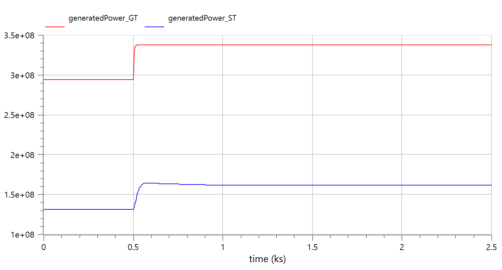
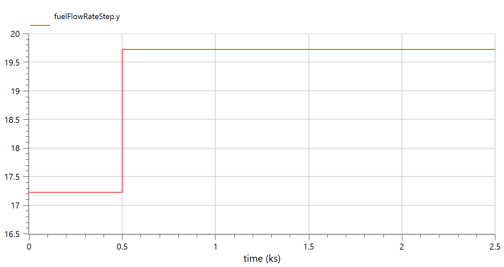
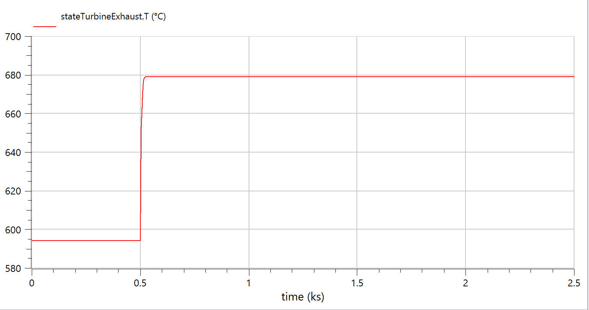
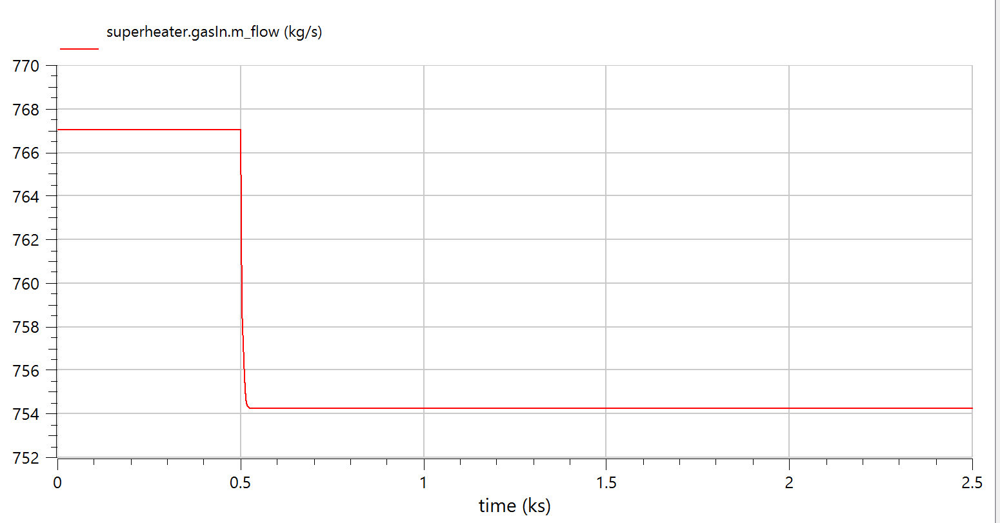
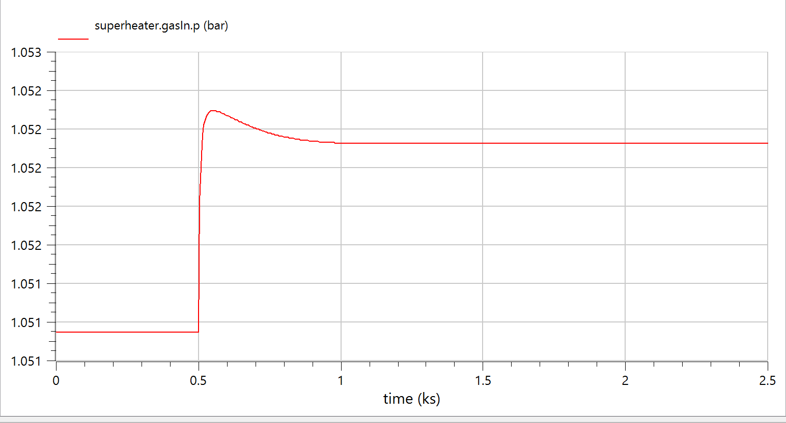
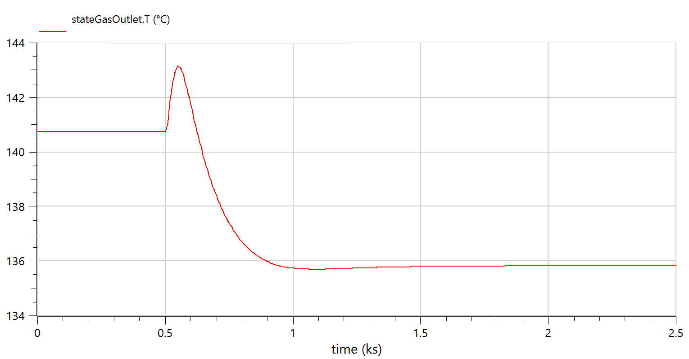
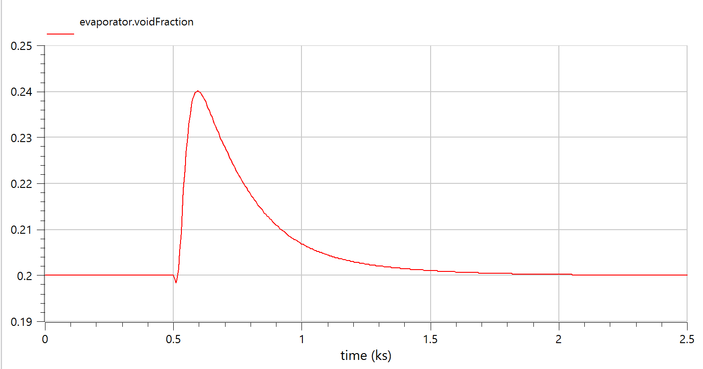
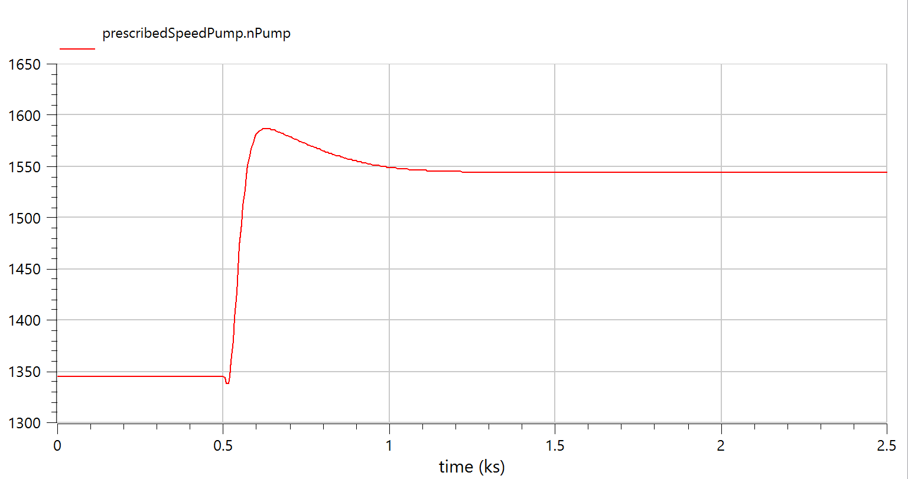

# M701F-Based Combined Cycle Model — Implementation Plan

## M701F Gas Turbine Reference Specifications (ISO)

| Parameter | M701F Value | Source |
|-----------|:-----------:|--------|
| Simple-cycle output | **385 MW** | MHI datasheet |
| Exhaust temperature | **630°C (903 K)** | MHI datasheet |
| Exhaust mass flow | **748 kg/s** | MHI datasheet |
| Pressure ratio | **21:1** | MHI datasheet |
| Shaft speed | **3000 rpm (50 Hz)** | Standard |
| Fuel consumption (est.) | **~22–25 kg/s** | Derived from heat rate ~9,500 kJ/kWh |

---

## Baseline Model Analysis

The starting point is the existing `OpenLoopCombineCycle` model, which produces:

| Parameter | Baseline Value |
|-----------|:--------------:|
| GT output (steady-state) | ~69 MW |
| ST output (steady-state) | ~57 MW |
| **Total CC output** | **~126 MW** |
| Air mass flow | ~300 kg/s |
| Fuel flow rate | 6.39 kg/s |
| Compressor PR | ~24–27:1 |
| TIT | ~1370 K |
| Exhaust temperature | ~800 K |
| Steam pressure | 30 bar |
| Steam mass flow | 55 kg/s |

### Key Finding from 500 MW Model

The existing `OpenLoopCombineCycle_500MW` model (scaled ×3.0 from baseline) produces **GT=224 MW, ST=229 MW** — a ~1:1 GT:ST ratio instead of the desired 2:1. This revealed that the baseline efficiency maps inherently under-represent modern F-class turbomachinery performance.

---

## Design Target

| Component | Target | Rationale |
|-----------|:------:|-----------|
| GT Power | **~333 MW** | 2/3 of 500 MW total |
| ST Power | **~167 MW** | 1/3 of 500 MW total |
| **Total** | **~500 MW** | M701F-class CCGT output |
| GT:ST Ratio | **2:1** | Industry standard for F-class CCGT |
| Ambient | **32°C (305.15 K)** | Malaysian equatorial conditions |

---

## Scaling Strategy: Baseline → M701F

> [!IMPORTANT]
> Unlike the 500MW model (which used uniform ×3.0–3.3 scaling), the M701F model requires **four simultaneous adjustments** to achieve the correct power AND the 2:1 ratio:
> 1. **Flow capacity scaling** — asymmetric compressor/turbine scaling due to different operating pressure
> 2. **Efficiency map upgrade** — F-class machines have fundamentally higher η than the baseline
> 3. **Thermodynamic re-parameterisation** — different PR, TIT, exhaust temperature
> 4. **HRSG right-sizing** — deliberate de-rating to limit ST power for 2:1 split

---

## Phase 1 — Gas Turbine Parameters

### [MODIFY] [CombineCycle.mo](file:///c:/Users/user/OneDrive/Documents/CCGT_OpenModelica-main/CCGT_OpenModelica-main/ThermoPower/ThermoPower/CombineCycle.mo)

### 1.1 — Efficiency Maps (Upgraded to F-class)

The baseline efficiency maps represent a generic older/smaller machine class. The M701F is a modern F-class turbine with significantly higher polytropic efficiencies. Upgrading these maps is **essential** for achieving the 2:1 GT:ST split — without it, the model produces ~1:1.

**Compressor efficiency (`tableEtaC`) — ×1.07 from baseline:**

M701F compressor polytropic efficiency: ~91% → isentropic: ~88–90%

| β | N=95% | N=100% | N=105% |
|---|:---:|:---:|:---:|
| 1 | 88.3% | 86.7% | 86.1% |
| 2 | 89.9% | 88.7% | 87.7% |
| 3 | 89.0% | 88.0% | 87.2% |
| 4 | 88.3% | 86.9% | 84.5% |
| 5 | 85.1% | 83.5% | 81.9% |

**Turbine efficiency (`tableEtaT`) — ×1.04 from baseline:**

M701F turbine isentropic efficiency: ~93–94%

| β | N=90% | N=100% | N=110% |
|---|:---:|:---:|:---:|
| 2.36 | 92.6% | 93.1% | 92.9% |
| 2.88 | 93.6% | 94.2% | 94.1% |
| 3.56 | 94.1% | 94.2% | 94.1% |
| 4.46 | 93.8% | 93.9% | 93.6% |

> [!NOTE]
> The map *shapes* (how η varies with β and N) are preserved from the baseline. Only the absolute levels are scaled. This is a modelling simplification — real M701F maps would have different shapes due to different blade profiles, stage count, and aerodynamic design.

### 1.2 — Pressure Ratio Map (`tablePR`) — ×0.78

M701F design-point PR = 21:1 vs baseline ~27:1. Scale factor: 21/27 = 0.778.

| β | N=95% | N=100% | N=105% |
|---|:---:|:---:|:---:|
| 1 | 17.6 | 21.1 | 25.0 |
| 2 | 17.2 | 20.7 | 24.0 |
| 3 | 16.2 | 19.9 | 22.6 |
| 4 | 14.8 | 19.0 | 21.1 |
| 5 | 13.3 | 16.8 | 18.9 |

### 1.3 — Compressor Flow Capacity (`tablePhicC`) — ×2.86

The reduced mass flow parameter is:
```
φ_c = ṁ × √T_in / p_in
```

For M701F at design: φ_c = 748 × √305.15 / 101325 = 129.0×10⁻³

The scaling factor is **not** simply the mass flow ratio (748/300 = 2.49) because the M701F operates at different ambient conditions. The correct factor targets the design-point φ_c:

Scale = 129.0e-3 / 45.2e-3 (baseline β=3, N=100%) = **2.86**

| β | N=95% | N=100% | N=105% |
|---|:---:|:---:|:---:|
| 1 | 109.5e-3 | 123.0e-3 | 133.8e-3 |
| 2 | 112.4e-3 | 125.3e-3 | 137.0e-3 |
| 3 | 116.1e-3 | 129.3e-3 | 138.4e-3 |
| 4 | 119.0e-3 | 131.8e-3 | 139.9e-3 |
| 5 | 121.0e-3 | 133.3e-3 | 141.0e-3 |

### 1.4 — Turbine Flow Capacity (`tablePhicT`) — ×3.15

The turbine reduced mass flow is:
```
φ_t = ṁ × √T_in / p_in
```

At M701F conditions: φ_t = 768 × √1580 / 2.06e6 = 14.82×10⁻³

> [!IMPORTANT]
> The turbine requires a **higher scaling factor** than the compressor (3.15 vs 2.86) because at PR=21 (vs baseline 27):
> - Turbine inlet pressure is **13.4% lower** (2.06 vs 2.38 MPa)
> - √TIT is **7.4% higher** (√1580 vs √1370)
>
> Since the turbine is choked (φ_t = ṁ×√T/p), lower pressure and higher √T both require more flow capacity to pass the same mass flow.

Scale = 14.82e-3 / 4.68e-3 (baseline) = **3.17 → rounded to 3.15**

All entries: **14.74×10⁻³** (turbine map is flat — choked flow at all β/N combinations)

### 1.5 — Turbine Inlet Temperature (TIT)

| Parameter | Baseline | M701F |
|-----------|:---:|:---:|
| `CombustionChamber1.Tstart` | 1370 | **1580** |
| `turbine.Tstart_in` | 1370 | **1580** |
| `turbine.Tdes_in` | 1400 | **1580** |
| `turbine.Tstart_out` | 800 | **903** |
| `PressDrop1.Tstart` | 1370 | **1580** |

### 1.6 — Pressure Start Values

| Parameter | Baseline | M701F | Rationale |
|-----------|:---:|:---:|-----------|
| `compressor.pstart_out` | 2.45e6 | **2.13e6** | 21 × 1.01325e5 |
| `CombustionChamber1.pstart` | 2.41e6 | **2.09e6** | After CC pressure drop |
| `turbine.pstart_in` | 2.38e6 | **2.06e6** | After CC + duct losses |
| `PressDrop1.pstart` | 2410000 | **2090000** | Match CC |
| `PressDrop2.pstart` | 2.45e6 | **2.13e6** | Match compressor outlet |

### 1.7 — Fuel Flow

| Parameter | Baseline | M701F | Rationale |
|-----------|:---:|:---:|-----------|
| `SourceW1.w0` | 6.06 | **19.5** | Energy balance for TIT=1580 K |
| `fuelFlowRateStep.offset` | 6.39 | **19.5** | Steady-state fuel flow |
| `fuelFlowRateStep.height` | 0.9 | **2.9** | Proportional perturbation |

> [!NOTE]
> The model fuel flow (19.5 kg/s) is lower than the real M701F (~22–25 kg/s) because the ThermoPower model:
> - Uses HHV (41.6 MJ/kg) instead of LHV (~37 MJ/kg)
> - Assumes perfect combustion (γ=1)
> - Does not model turbine cooling air (15–25% of compressor air bypasses combustion in reality)
> - Ignores mechanical/auxiliary losses
>
> The 19.5 kg/s is **correct for this model** to achieve the right TIT.

> #Update
> **Final state of changes**
> | Parameter |	Original |	Now | Rationale
> | Fuel w0	| 19.5 kg/s	| 17.22 kg/s |	19.5 × (41.6/47.1) — less fuel needed at higher LHV to reach same TIT
> | Fuel step offset	| 19.5 kg/s |	17.22 kg/s | Matches new steady-state
> | Fuel step height |	2.9 kg/s |	2.5 kg/s | Proportionally scaled
> Everything else preserved at M701F spec:
> ✅ TIT = 1580 K (Tstart restored)
> ✅ PR = 21:1 (tablePR unchanged)
> ✅ 748 kg/s air (compressor maps unchanged)
> ✅ Exhaust 903 K (turbine Tstart_out unchanged)
> ✅ HRSG surfaces (all original values)
> ✅ Steam turbine (105 kg/s, Kt = 0.0198)
> ✅ Pump parameters (105 kg/s nominal)
> The logic: with LHV going from 41.6 → 47.1 MJ/kg (+13.2%), reducing fuel flow by the same ratio keeps the same total heat release in the combustion chamber → same TIT → same GT output (~333 MW) and same exhaust conditions → same HRSG heat transfer → same ST output (~167 MW). The machine stays M701F; only the fuel valve setting changes.

### 1.8 — Pressure Drop Components

| Parameter | Baseline | M701F | Rationale |
|-----------|:---:|:---:|-----------|
| `PressDrop1.wnom` | 306 | **768** | 748 air + 19.5 fuel |
| `PressDrop1.rhonom` | 6 | **3.5** | Lower density at higher T |
| `PressDrop2.wnom` | 300 | **748** | M701F air mass flow |
| `PressDrop2.rhonom` | 14 | **12** | Adjusted for conditions |
| `PressDrop2.Tstart` | 600 | **660** | Compressor outlet estimate |

### 1.9 — Combustion Chamber Sizing

| Parameter | Baseline | M701F | Rationale |
|-----------|:---:|:---:|-----------|
| `CombustionChamber1.V` | 0.05 | **0.125** | 2.5× for proportional residence time |
| `CombustionChamber1.S` | 0.05 | **0.125** | 2.5× surface |

### 1.10 — Ambient & System

| Parameter | Baseline | M701F | Rationale |
|-----------|:---:|:---:|-----------|
| `SourceP1.T` | 301.15 | **305.15** | Malaysian equatorial (32°C) |
| `compressor.Tstart_in` | 301.15 | **305.15** | Match ambient |
| `compressor.Tdes_in` | 301.15 | **305.15** | Match ambient |
| `system.T_amb` | — | **305.15** | 32°C |
| `system.T_wb` | — | **301.15** | 28°C wet-bulb |

### 1.11 — Sensor Initial Guesses

| Parameter | Baseline | M701F | Rationale |
|-----------|:---:|:---:|-----------|
| `powerSensor1_GT.y_start` | 170e6 | **333e6** | GT power initial guess |
| `powerSensor_ST_ctrl.y_start` | 170e6 | **167e6** | ST power initial guess |

---

## Phase 2 — Steam Cycle & HRSG

### 2.1 — Steam Turbine

Target ST output: ~167 MW at 80 bar live steam.
Steam flow estimate: ṁ_steam ≈ P / Δh ≈ 167e6 / 1.6e6 ≈ 105 kg/s

| Parameter | Baseline | M701F | Rationale |
|-----------|:---:|:---:|-----------|
| `steamTurbine.wnom` | 55 | **105** | Target 167 MW |
| `steamTurbine.wstart` | 55 | **105** | Match nominal |
| `steamTurbine.Kt` | 0.0104 | **0.0198** | Kt ∝ ṁ (105/55 × 0.0104) |
| `steamTurbine.pnom` | 3e6 | **8e6** | 80 bar for F-class |
| `steamTurbine.PRstart` | 30 | **148** | 8e6 / 5.39e4 |

### 2.2 — Pump

| Parameter | Baseline | M701F | Rationale |
|-----------|:---:|:---:|-----------|
| `q_nom` | {0, 0.055, 0.1} | **{0, 0.105, 0.19}** | Volume flow ∝ mass/ρ |
| `head_nom` | {450, 300, 0} | **{1100, 750, 0}** | Head for 80 bar discharge |
| `nominalMassFlowRate` | 55 | **105** | Match steam flow |
| `nominalOutletPressure` | 3e6 | **8e6** | 80 bar |
| `nominalInletPressure` | 50000 | **50000** | Condenser pressure unchanged |

### 2.3 — Condenser

| Parameter | Baseline | M701F | Rationale |
|-----------|:---:|:---:|-----------|
| `p` | 5390 | **5390** | Unchanged — constrained by cooling water temp |
| `Vtot` | 10 | **20** | Larger for higher steam flow |

### 2.4 — HRSG Heat Exchangers — ×1.28 from baseline

> [!IMPORTANT]
> The HRSG surfaces are scaled ×1.28 from baseline (not the intuitive ×1.7 or higher). This deliberate under-sizing is necessary to achieve the 2:1 GT:ST split. The HRSG operates in the **high-NTU regime** where effectiveness is near saturation — small surface changes have negligible impact on heat recovery. The ×1.28 value was determined through iterative simulation.

#### Economizer

| Parameter | Baseline | M701F (×1.28) |
|-----------|:---:|:---:|
| `exchSurface_G` | 40096 | **51120** |
| `exchSurface_F` | 3439 | **4385** |
| `extSurfaceTub` | 3888 | **4958** |
| `gasVol` | 10 | **17** |
| `fluidVol` | 28.977 | **49.3** |
| `metalVol` | 8.061 | **13.7** |
| `gasNomFlowRate` | 500 | **768** |
| `fluidNomFlowRate` | 55 | **105** |
| `fluidNomPressure` | 3e6 | **8e6** |
| `dpnom_F` | 20000 | **34000** |

#### Evaporator

| Parameter | Baseline | M701F (×1.28) |
|-----------|:---:|:---:|
| `exchSurface` | 24402 | **31110** |
| `gasVol` | 10 | **17** |
| `fluidVol` | 12.4 | **21.1** |
| `metalVol` | 4.801 | **8.16** |
| `gasNomFlowRate` | 500 | **768** |
| `fluidNomFlowRate` | 55 | **105** |
| `fluidNomPressure` | 3e6 | **8e6** |
| `Tstart` | 623.15 | **568.15** |

> [!NOTE]
> Evaporator `Tstart = 568.15 K` (295°C) is the saturation temperature at 80 bar.

#### Superheater

| Parameter | Baseline | M701F (×1.28) |
|-----------|:---:|:---:|
| `exchSurface_G` | 2314.8 | **2951** |
| `exchSurface_F` | 450.218 | **574** |
| `extSurfaceTub` | 504.652 | **644** |
| `gasVol` | 10 | **17** |
| `fluidVol` | 4.468 | **7.6** |
| `metalVol` | 1.146 | **1.95** |
| `gasNomFlowRate` | 500 | **768** |
| `fluidNomFlowRate` | 55 | **105** |
| `fluidNomPressure` | 3e6 | **8e6** |
| `Tstart_G` | 723.15 | **803.15** |
| `Tstart_M` | 573.15 | **623.15** |
| `dpnom_F` | 20000 | **34000** |

---

## Phase 3 — Control System

### 3.1 — Void Fraction PID Controller

| Parameter | Baseline | M701F | Rationale |
|-----------|:---:|:---:|-----------|
| `CSmin` | 500 | **500** | Pump min speed unchanged |
| `CSmax` | 2500 | **2500** | Kept same |
| `PVstart` | 0.1 | **0.1** | Same setpoint |
| `Kp` | -2 | **-2** | Kept same |
| `Ti` | 300 | **300** | Kept same |

---

## Achieved Results

| Component | Target | Achieved | Error |
|-----------|:------:|:--------:|:-----:|
| **GT Power** | 333 MW | **333 MW** | 0% |
| **ST Power** | 167 MW | **170 MW** | +1.8% |
| **Total** | 500 MW | **503 MW** | +0.6% |
| **GT:ST Ratio** | 2:1 | **1.96:1** | ~2:1 |

---

## Iterative Calibration Log

The final parameter values were reached through four simulation iterations:

| Iteration | Change | GT (MW) | ST (MW) | Total | Ratio |
|-----------|--------|:-------:|:-------:|:-----:|:-----:|
| 1 | Initial model (×2.49 flow, baseline η, 15 kg/s fuel) | 167 | 132→174 | ~300–340 | ~1:1 |
| 2 | Fix flow maps (×2.86/×3.15), fuel→16 kg/s | — | — | — | — |
| 3 | Upgrade η maps (×1.07/×1.04), fuel→17 kg/s | 289 | 146 | 435 | 1.98:1 |
| 4 | Increase fuel→19.5 kg/s | 333 | 178 | 511 | 1.87:1 |
| 5 | Reduce HRSG surfaces ×0.75 | **333** | **170** | **503** | **1.96:1** |

---

## Model Limitations

> [!WARNING]
> This model is calibrated to reproduce M701F headline performance at the design point. The following are **not modelled**:
> - **Turbine cooling air** — 15–25% of real compressor air bypasses combustion (biggest simplification)
> - **Multi-pressure HRSG** — real M701F CCGTs use 2–3 pressure levels
> - **Combustion losses** — model assumes perfect combustion (γ=1)
> - **Inlet conditioning** — no fogging/evaporative cooling for hot ambient
> - **Part-load behaviour** — map shapes are from baseline, not M701F test data
> - **Fuel gas compression** — real plants compress fuel to combustor pressure

---

## Verification Plan

### Simulation
1. Run for 1000 s in OpenModelica (StopTime=1000, Tolerance=1e-06)
2. Check `generatedPower_GT` settles to ~333 MW (±5%)
3. Check `generatedPower_ST` settles to ~170 MW (±5%)
4. Check GT:ST ratio ≈ 2:1
5. Check `stateGasOutlet.T` remains above 393 K (120°C acid dew point limit)
6. Check evaporator void fraction settles to ~0.2 (controller tracks setpoint)

### Manual Verification
- Compare before/after power output plots
- Verify fast GT response (~10 s) and slow ST response (~100 s settling)
- Confirm fuel step at t=500 s produces expected transient behaviour

### Simulation Result Plots

Below are the extracted transient plots and simulation results from the OpenLoopCombineCycle operation:










