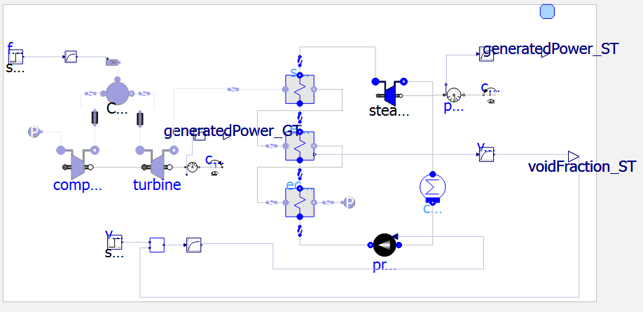
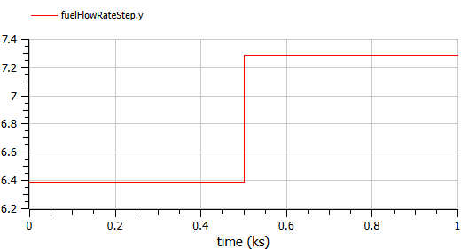
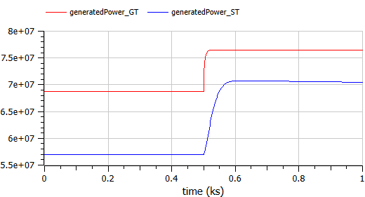
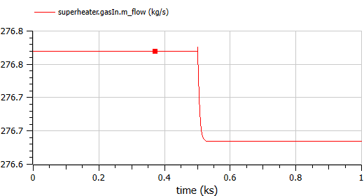
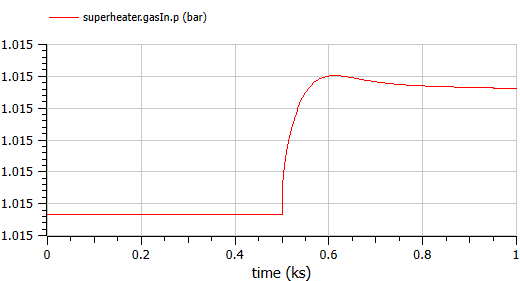
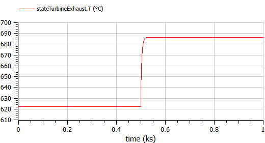
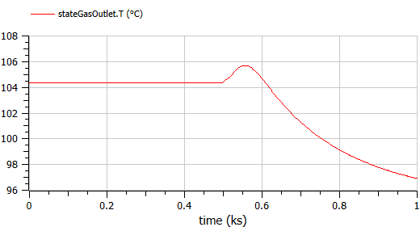
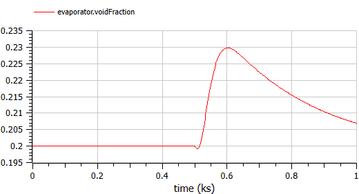
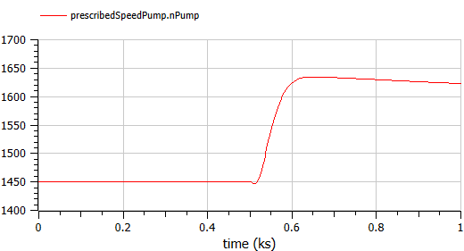

# Combined Cycle Gas Turbine (CCGT) Power Plant Simulation
### A ThermoPower-based Open-Source Modelica Implementation

> **Repository:** `https://github.com/kiinging/CCGT_OpenModelica.git`  
> **Branch:** `CCGT_OpenModelica_basic`

---

## Abstract

This repository presents an open-source, equation-based simulation of a Combined Cycle Gas Turbine (CCGT) power plant, implemented in the Modelica modelling language using the ThermoPower library. Two simulator variants are provided: an **open-loop** model for steady-state and transient characterisation, and a **closed-loop** model demonstrating PID-based power dispatch control. The plant integrates a Brayton-cycle Gas Turbine (GT) with a single-pressure Heat Recovery Steam Generator (HRSG) and a Rankine-cycle Steam Turbine (ST), achieving a combined thermal efficiency of approximately **45%** — approximately 23% contributed by the GT subsystem and the remainder recovered by the ST subsystem.

---

## Table of Contents

1. [Prerequisites and Installation](#1-prerequisites-and-installation)
2. [Getting Started — Running the Simulation](#2-getting-started--running-the-simulation)
3. [System Architecture Overview](#3-system-architecture-overview)
4. [Gas Turbine (Brayton Cycle) — Physical Parameters](#4-gas-turbine-brayton-cycle--physical-parameters)
5. [Energy Flow Path](#5-energy-flow-path)
6. [Heat Recovery Steam Generator (HRSG)](#6-heat-recovery-steam-generator-hrsg)
7. [Efficiency Analysis](#7-efficiency-analysis)
8. [Key Thermodynamic Variables for Post-Processing](#8-key-thermodynamic-variables-for-post-processing)
9. [Operational Constraints and Physical Considerations](#9-operational-constraints-and-physical-considerations)
10. [Simulation Result Plots](#10-simulation-result-plots)

---

## 1. Prerequisites and Installation

### 1.1 Install OpenModelica

OpenModelica is a free, open-source Modelica simulation environment and is required to run this project.

1. Navigate to the official OpenModelica download page: [https://openmodelica.org/download/download-windows/](https://openmodelica.org/download/download-windows/)
2. Download and install the **latest stable release** for your operating system (Windows recommended).
3. Launch **OMEdit** (OpenModelica Connection Editor) from the Start Menu to confirm a successful installation.

> **Note:** It is recommended to use OpenModelica version **1.21** or later to ensure compatibility with all ThermoPower library features used in this project.

### 1.2 Clone the Repository

Open a terminal (Command Prompt, PowerShell, or Git Bash) and execute the following commands:

```bash
# Clone the repository
git clone -b CCGT_OpenModelica https://github.com/kiinging/CCGT_OpenModelica.git

# Enter the project directory
cd CCGT_OpenModelica

# Checkout the correct branch
git branch
```

The project directory structure is as follows:

```
CCGT_OpenModelica/
├── ThermoPower/
│   └── ThermoPower/
│       └── CombineCycle.mo      ← Main model file
├── images/                      ← Simulation result plots
└── README.md
```

### 1.3 Load the Library in OMEdit

1. Open **OMEdit**.
2. From the top menu, select **File → Open Model/Library File(s)**.
3. Navigate to `ThermoPower/ThermoPower/` and open `CombineCycle.mo`.
4. In the **Libraries** panel on the left, expand `ThermoPower → CombineCycle → Simulators`. You should see both `OpenLoopCombineCycle` and `CloseLoopCombineCycle`.

---

## 2. Getting Started — Running the Simulation

It is recommended to run the two simulator models in sequence: open-loop first to understand the plant's natural transient response, and closed-loop second to observe the PID control behaviour.

### 2.1 Step 1 — Open-Loop Simulation

The **`ThermoPower.CombineCycle.Simulators.OpenLoopCombineCycle`** model applies a **step change in fuel flow rate** at *t* = 500 s (from 6.39 kg/s to 7.29 kg/s) with no feedback controller. This allows the analyst to observe the uncontrolled plant response and characterise the open-loop dynamics of both the GT and ST subsystems.

**To run:**
1. Double-click `OpenLoopCombineCycle` in the Libraries panel to open it.
2. Select **Simulation → Simulate** (or press **F8**).
3. Set the simulation stop time to **1000 s** with a suitable output interval (e.g., 1 s).
4. Click **OK** and wait for the simulation to complete.
5. In the **Variables** panel, browse and check the desired variables (see Section 8) to visualise the time-series responses.

### 2.2 Step 2 — Closed-Loop Simulation

The **`ThermoPower.CombineCycle.Simulators.CloseLoopCombineCycle`** model introduces a **PID power controller** that modulates the fuel flow rate in response to a power set-point signal. This is the primary model for control studies, as it demonstrates the closed-loop regulation of total GT electrical output.

**To run:**
1. Double-click `CloseLoopCombineCycle` in the Libraries panel.
2. Select **Simulation → Simulate** (or press **F8**).
3. Set the simulation stop time to **1000 s**.
4. Click **OK** and observe the PID transient response.

> **Tip — Switching between Step and Ramp set-points:** Inside the `CloseLoopCombineCycle` model, the parameter `spDuration` controls the shape of the set-point signal. Set `spDuration = 0` for a **step test** (useful for PID tuning) or `spDuration > 0` (e.g., 50 s) for a **ramp test** (useful for smooth power dispatch validation).

### 2.3 Suggested Exploration Order

Both models share an **identical physical plant**. The open-loop model is simpler to interpret, while the closed-loop model is more representative of real operational practice. It is therefore recommended that the analyst:

1. Run the open-loop model to establish baseline steady-state conditions.
2. Switch to the closed-loop model to study the PID controller's effect on the same physical system.
3. Compare the fuel flow rate, TIT, GT power, and ST power responses between the two models.

---

## 3. System Architecture Overview

The plant is modelled as three coupled subsystems:

```
[Fuel Input]
     |
     ▼
[Gas Turbine (Brayton Cycle)]
 Compressor → Combustion Chamber → Gas Turbine Expander → Generator
                                          |
                                          ▼ (Hot Exhaust ≈ 900 K)
                              [HRSG — Single Pressure Stage]
                          Superheater → Evaporator → Economizer
                                          |
                                          ▼
                              [Steam Turbine (Rankine Cycle)]
                          Steam Turbine Expander → Generator → Condenser
```

The two subsystems are thermally coupled: the GT exhaust gas (at approximately 900 K) flows sequentially through the HRSG superheater, evaporator, and economizer, transferring its residual thermal energy to the steam-water circuit before being vented to the atmosphere at the stack.

---

## 4. Gas Turbine (Brayton Cycle) — Physical Parameters

The following parameters describe the Gas Turbine subsystem, which reflects the physical characteristics of a large-frame industrial gas turbine:

| Parameter | Symbol | Value | Unit | Notes |
|---|---|---|---|---|
| Compressor inlet pressure | *p*₀ | 1.01325 × 10⁵ | Pa | Standard atmospheric |
| Compressor discharge pressure | *p*_cd | 2.45 × 10⁶ | Pa | Pressure ratio ≈ 24 |
| Compressor inlet temperature | *T*_in | 301.15 | K | 28 °C ambient |
| Compressor outlet temperature | *T*_out | 600.4 | K | ≈ 327 °C |
| Turbine Inlet Temperature (TIT) | *T*_TIT | 1600 | K | ≈ 1327 °C |
| Turbine outlet temperature | *T*_out | 900 | K | ≈ 627 °C |
| Design shaft speed | *N*_design | 157.08 | rad/s | ≈ 1500 RPM |
| Nominal fuel (natural gas) flow | *ṁ*_fuel | ~6.4–7.3 | kg/s | Varies with load |
| Nominal air (compressor) flow | *ṁ*_air | ~300 | kg/s | Air-to-fuel ratio ≈ 40:1 |
| Nominal flue gas flow | *ṁ*_gas | ~306 | kg/s | Fuel + air mixture |
| Natural gas heating value | *HH* | 41.6 × 10⁶ | J/kg | Lower heating value |
| Combustion chamber pressure | *p*_cc | 2.41 × 10⁶ | Pa | |
| Compressor peak isentropic efficiency | *η*_C | ~89% | — | Modern large-frame compressor |
| Turbine isentropic efficiency | *η*_T | ~90.6% | — | At design point |

> **Physical Interpretation:** The high TIT of 1600 K reflects the operating condition of a modern large-frame gas turbine (equivalent to approximately F-class or G-class machines). The large air-to-fuel ratio (~40:1) is essential: the excess air acts as a diluent and coolant, preventing the turbine blades from exceeding their metallurgical temperature limits. The compressor efficiency values have been increased by approximately 5 percentage points relative to the baseline ThermoPower model to reflect the aerodynamic advancements of contemporary compressor blade designs.

### Pressure Ratio

The nominal compressor pressure ratio (PR) is:

$$\text{PR} = \frac{p_\text{cd}}{p_0} = \frac{2.45 \times 10^6}{1.01325 \times 10^5} \approx 24.2$$

This value is consistent with modern industrial gas turbines operating at the design point.

---

## 5. Energy Flow Path

The following describes the complete energy flow path from fuel injection to electrical output, which is the primary focus for model exploration:

### 5.1 Fuel Injection → Combustion Thermal Power

The thermal power input to the cycle is determined by the fuel mass flow rate and the lower heating value of natural gas:

$$\dot{Q}_\text{in} = \dot{m}_\text{fuel} \times HH$$

At the nominal operating point (ṁ_fuel ≈ 6.4 kg/s):

$$\dot{Q}_\text{in} = 6.4 \, \text{kg/s} \times 41.6 \times 10^6 \, \text{J/kg} \approx 266 \, \text{MW}$$

In the model, this is governed by the `SourceW1` (fuel mass flow source) and `CombustionChamber1` components. The resulting hot flue gas exits at the **Turbine Inlet Temperature (TIT)**, observable at `stateOutletCC.T`.

### 5.2 Combustion Chamber → Gas Turbine Electrical Output

The hot flue gas at TIT (≈ 1600 K) expands through the gas turbine, performing shaft work. The shaft is coupled to a generator via the `powerSensor_GT` component. The gross electrical output of the GT is monitored at `generatedPower_GT`.

At the nominal operating condition, the GT produces approximately **60–76 MW**, yielding a standalone GT efficiency of:

$$\eta_\text{GT} = \frac{\dot{W}_\text{GT}}{\dot{Q}_\text{in}} \approx \frac{62 \, \text{MW}}{266 \, \text{MW}} \approx 23\%$$

### 5.3 GT Exhaust → HRSG

The turbine exhaust gas (≈ 900 K, 306 kg/s) is routed to the HRSG inlet. In the model, this coupling is represented by the connection from `turbine.outlet` through `stateTurbineExhaust` to `superheater.gasIn`. The exhaust gas temperature at this point is observable at `stateTurbineExhaust.T`.

### 5.4 HRSG → Steam Turbine Electrical Output

The HRSG transfers heat to the steam-water circuit across three heat exchanger stages (superheater, evaporator, and economizer). The resulting superheated steam drives the Steam Turbine (`steamTurbine`), the output of which is monitored at `generatedPower_ST`. The ST contributes the remaining ~22% efficiency.

---

## 6. Heat Recovery Steam Generator (HRSG)

The HRSG in this simulation is a **single-pressure, counter-flow** configuration comprising three stages in series:

| Stage | Model Component | Nominal Gas Flow (kg/s) | Nominal Steam/Water Flow (kg/s) |
|---|---|---|---|
| Superheater | `superheater` | 500 | 30 |
| Evaporator | `evaporator` | 500 | 30 |
| Economizer | `economizer` | 500 | 30 |

> **Design Note:** The steam-side nominal mass flow rate has been deliberately set to **30 kg/s** (a relatively high value for a single-pressure configuration) with the objective of maximising the thermal energy recovered from the GT exhaust. This design choice increases the heat absorption rate in the HRSG, thereby improving the overall plant efficiency. The trade-off is a higher pressure drop on the water side.

The steam-side operating pressure is approximately **3.0 MPa**, and the condenser operates at a saturation pressure of **5,390 Pa** (a deep vacuum, corresponding to a saturation temperature of approximately 34 °C).

The void fraction in the evaporator (ratio of steam volume to total drum volume) is regulated by a PID controller (`voidFractionController`) that modulates the feedwater pump speed, maintaining the void fraction at a set-point of approximately **0.2**.

---

## 7. Efficiency Analysis

The overall plant thermal efficiency is defined as:

$$\eta_\text{CCGT} = \frac{\dot{W}_\text{GT} + \dot{W}_\text{ST}}{\dot{Q}_\text{in}}$$

At the nominal operating condition in this simulation:

| Quantity | Value |
|---|---|
| Fuel thermal input, $\dot{Q}_\text{in}$ | ≈ 266 MW |
| GT electrical output, $\dot{W}_\text{GT}$ | ≈ 62 MW (≈ 23%) |
| ST electrical output, $\dot{W}_\text{ST}$ | ≈ 58 MW (≈ 22%) |
| **Total combined output** | **≈ 120 MW** |
| **Overall CCGT efficiency** | **≈ 45%** |

This overall efficiency is consistent with the lower end of real-world single-pressure CCGT plants, where multi-pressure HRSG designs and advanced turbine cooling technologies allow efficiencies of up to 60%.

---

## 8. Key Thermodynamic Variables for Post-Processing

After a successful simulation, the following variables can be selected in the OMEdit **Variables** panel and plotted as time-series:

### Gas Turbine Side

| Variable | Physical Meaning | Units |
|---|---|---|
| `stateInletCC.T` | Air temperature entering combustion chamber (compressor exit) | K |
| `stateOutletCC.T` | **Turbine Inlet Temperature (TIT)** — combustion chamber exit | K |
| `stateTurbineExhaust.T` | GT exhaust temperature entering HRSG | K |
| `CombustionChamber1.T` | Internal combustion chamber temperature | K |
| `generatedPower_GT` | GT gross electrical power output | W |
| `SourceW1.w0` | Fuel mass flow rate | kg/s |

### Steam Turbine / HRSG Side

| Variable | Physical Meaning | Units |
|---|---|---|
| `stateGasOutlet.T` | Stack exhaust temperature (HRSG exit) | K |
| `stateWaterSuperheater_out.T` | Superheated steam temperature entering ST | K |
| `steamTurbine.Tout` | Steam turbine exhaust temperature | K |
| `evaporator.voidFraction` | Steam void fraction in evaporator drum | — |
| `generatedPower_ST` | ST gross electrical power output | W |
| `condenser.p` | Condenser saturation pressure | Pa |

---

## 9. Operational Constraints and Physical Considerations

### 9.1 Turbine Inlet Temperature Limit
The TIT is the primary thermodynamic driver of efficiency. However, it is bounded by the thermal limits of the turbine blade alloys and cooling systems. In this model, the TIT is set to **1600 K**, representative of a modern F/G-class machine. Exceeding this limit in a real plant risks rapid creep and oxidative degradation of the first-stage turbine blades.

### 9.2 Air-to-Fuel Ratio and Dilution Cooling
The mass flow of compressed air (~300 kg/s) greatly exceeds the fuel flow (~6.4 kg/s), yielding an air-to-fuel ratio of approximately **40:1**. The excess air is not a thermodynamic waste — it serves as the primary blade-cooling medium in the combustion zone, diluting the flame to maintain the allowable TIT.

### 9.3 Acid Dew Point Constraint
The stack exhaust temperature (`stateGasOutlet.T`) must be monitored carefully. Natural gas combustion produces trace quantities of sulphur oxides (SOₓ). If the exhaust gas temperature falls below approximately **393 K (120 °C)**, sulphuric acid (H₂SO₄) can condense on HRSG and stack internals, causing severe corrosion. Operators and control designers must ensure that the stack temperature remains above this **acid dew point** under all operating conditions.

### 9.4 Evaporator Void Fraction
The ratio of steam volume to total drum volume (void fraction) is a key indicator of evaporator health. In this model, the target void fraction is **0.2**, controlled by the feedwater pump speed. An excessively high void fraction risks steam starvation; an excessively low value indicates flooding of the drum.

### 9.5 HRSG Pinch Point
The pinch point is the minimum temperature difference between the hot gas stream and the boiling water inside the evaporator. A very small pinch point indicates maximum heat recovery but imposes an impractically large heat exchanger surface area. This model uses fixed heat transfer coefficients (γ_G ≈ 85 W/m²·K) to represent a practical design compromise.

---

## 10. Simulation Result Plots

The following plots were obtained from the `OpenLoopCombineCycle` simulation (fuel step from 6.39 kg/s to 7.29 kg/s at *t* = 500 s):











---

## References

- Casella, F., & Leva, A. (2005). *Modelica open-source library for power plant simulation: Design and experimental validation.* Proceedings of the 4th International Modelica Conference.
- ThermoPower Library Documentation: [https://thermopower.sourceforge.net](https://thermopower.sourceforge.net)
- Boyce, M. P. (2012). *Gas Turbine Engineering Handbook* (4th ed.). Butterworth-Heinemann.
- Kehlhofer, R., Hannemann, F., Stirnimann, F., & Rukes, B. (2009). *Combined-Cycle Gas and Steam Turbine Power Plants* (3rd ed.). PennWell.
