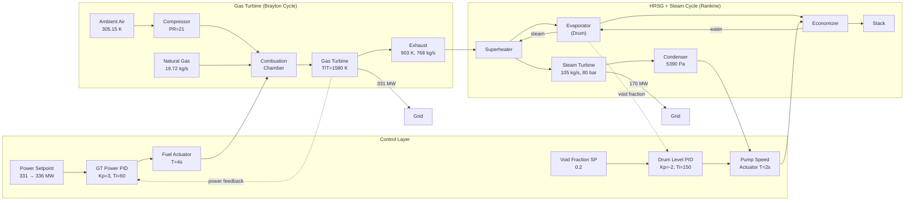

# M701F Closed-Loop CCGT Model — Framework Walkthrough

## 1. System Overview

The `CloseLoopCombineCycle_M701F` model implements a **500 MW class combined cycle gas turbine (CCGT) power plant** based on the Mitsubishi M701F gas turbine, modeled in OpenModelica using the ThermoPower library. The model features automated power tracking via PID-controlled fuel flow, under Malaysian equatorial ambient conditions (32°C, 1.01325 bar).



---

## 2. Plant Architecture

### 2.1 Gas Turbine (Brayton Cycle) — ~331 MW

The GT subsystem models a Mitsubishi M701F heavy-duty gas turbine with these specifications:

| Parameter | Value | Model Component |
|---|---|---|
| **Compressor PR** | 21:1 | `tablePR` scaled ×0.78 from baseline |
| **Air mass flow** | 748 kg/s | `tablePhicC` scaled ×2.86 |
| **TIT** | 1580 K (1307°C) | `Tdes_in = 1580` |
| **Exhaust temperature** | 903 K (630°C) | `Tstart_out = 903` |
| **Shaft speed** | 157 rad/s (1500 rpm) | `constantSpeed_GT` |
| **Fuel (natural gas)** | 19.72 kg/s @ 331 MW | `SourceW1.w0 = 19.72` |
| **LHV** | 47.1 MJ/kg | `CombustionChamber1.HH` |

**Key components:**
- [compressor](file:///c:/Users/user/OneDrive/Documents/CCGT_OpenModelica-main%20-%20M701F%20working%20model/CCGT_OpenModelica-main/ThermoPower/ThermoPower/CombineCycle.mo#L1207): Axial compressor with 2D efficiency/flow/PR maps
- [turbine](file:///c:/Users/user/OneDrive/Documents/CCGT_OpenModelica-main%20-%20M701F%20working%20model/CCGT_OpenModelica-main/ThermoPower/ThermoPower/CombineCycle.mo#L1209): Gas turbine with F-class efficiency maps (η_is ≈ 93–94%)
- [CombustionChamber1](file:///c:/Users/user/OneDrive/Documents/CCGT_OpenModelica-main%20-%20M701F%20working%20model/CCGT_OpenModelica-main/ThermoPower/ThermoPower/CombineCycle.mo#L1211): Constant-pressure combustor with LHV = 47.1 MJ/kg

### 2.2 Heat Recovery Steam Generator (HRSG) — Single-Pressure, 80 bar

The HRSG is a once-through, single-pressure design operating at 80 bar (8 MPa). The GT exhaust (768 kg/s at 903 K) passes through three heat exchangers in series:

| Heat Exchanger | Gas-Side Surface | Gas Temp Range | Water Phase |
|---|---|---|---|
| **Superheater** | 2,951 m² | 903 → ~700 K | Saturated steam → superheated |
| **Evaporator** | 31,110 m² | ~700 → ~500 K | Subcooled water → saturated steam |
| **Economizer** | 51,120 m² | ~500 → ~420 K | Feedwater preheating |

The evaporator uses a `DrumEquilibrium` model — a lumped-parameter drum that tracks liquid/vapour volumes. The **void fraction** (Vv/Vd) is the controlled variable for drum level regulation.

### 2.3 Steam Turbine (Rankine Cycle) — ~170 MW

| Parameter | Value |
|---|---|
| **Steam flow** | 105 kg/s |
| **Inlet pressure** | 80 bar (8 MPa) |
| **Condenser pressure** | 5,390 Pa (~0.054 bar) |
| **Pressure ratio** | ~148 |
| **Turbine constant Kt** | 0.0198 |
| **Shaft speed** | 157 rad/s (fixed) |

The steam turbine uses the `SteamTurbineStodola` model (Stodola's ellipse law) which naturally adjusts steam flow based on inlet/outlet pressure ratio.

---

## 3. Control System Design

The closed-loop model has **two independent PID control loops**:

### 3.1 Loop 1: GT Power Controller (Primary)

```
Setpoint (331 MW) → PID → Fuel Actuator → Combustion Chamber → GT Power → Feedback
```

| PID Parameter | Value | Physical Meaning |
|---|---|---|
| **PVmin / PVmax** | 0 / 500 MW | GT power measurement range |
| **CSmin / CSmax** | 10 / 21 kg/s | Fuel flow operating limits |
| **Kp** | 3 | Moderate proportional gain |
| **Ti** | 60 s | Slow integral — prevents oscillation |
| **PVstart** | 0.662 | 331 MW / 500 MW (scaled) |
| **CSstart** | 0.884 | (19.72 − 10) / (21 − 10) (scaled) |
| **holdWhenSimplified** | true | Aids homotopy initialization |
| **steadyStateInit** | true | der(I) = 0 at t=0 |

**Setpoint schedule:**
- t = 0–800 s: 331 MW (steady-state hold)
- t = 800–850 s: Ramp from 331 → 336 MW (+5 MW over 50 s)
- t > 850 s: Hold at 336 MW

**Signal path:**
1. `powerSetPoint` (Ramp block) → `powerController.SP`
2. `generatedPower_GT` → `powerController.PV` (feedback)
3. `powerController.CS` → `fuelFlowActuator` (1st-order lag, T=4s) → `SourceW1.in_w0`

> [!IMPORTANT]
> **CSmax = 21 kg/s is critical.** This hard-limits fuel flow to prevent the HRSG from being overwhelmed. From calibration data, each additional kg/s of fuel adds ~6.5 MW to the GT but ~13 MW to the ST, so fuel overshoot has 2× the impact on the steam cycle.

### 3.2 Loop 2: Drum Level Controller (Secondary)

```
Setpoint (VF=0.2) → PID → Pump Speed → Feedwater Flow → Drum Level → Feedback
```

| PID Parameter | Value | Physical Meaning |
|---|---|---|
| **PVmin / PVmax** | 0.1 / 0.9 | Void fraction measurement range |
| **CSmin / CSmax** | 500 / 3500 rpm | Pump speed operating limits |
| **Kp** | −2 | Negative: ↑void fraction → ↑pump speed |
| **Ti** | 150 s | Integral for steady-state correction |
| **PVstart** | 0.125 | (0.2 − 0.1) / (0.9 − 0.1) scaled |
| **CSstart** | 0.333 | (1500 − 500) / (3500 − 500) scaled |

**Control logic:** When the drum void fraction increases (more steam, less water), the PID increases pump speed to add more feedwater, restoring the liquid level.

> [!NOTE]
> The negative Kp is required because the PID equation computes `P = SP - PV`. When void fraction rises above setpoint, `P` becomes negative. With `Kp = -2`, the negative × negative = positive, increasing the control signal (pump speed). This is the standard "reverse-acting" controller configuration.

---

## 4. Calibration Process

### 4.1 Open-Loop Baseline

The closed-loop parameters were calibrated against the `OpenLoopCombineCycle_M701F` model:

| Fuel Flow (kg/s) | GT Power (MW) | ST Power (MW) | Total (MW) |
|---|---|---|---|
| 17.22 (offset) | 289 | 140 | 429 |
| **19.72** (after +2.5 step) | **331** | **170** | **501** |

This established:
- **Steady-state fuel for 331 MW GT = 19.72 kg/s** (not the originally assumed 17.22)
- **Fuel sensitivity**: ~16.8 MW_GT per kg/s (289→331 over 2.5 kg/s)
- **ST sensitivity**: ~12 MW_ST per kg/s (140→170 over 2.5 kg/s)

### 4.2 Closed-Loop Calibration Issues Encountered & Fixed

| Issue | Root Cause | Fix Applied |
|---|---|---|
| Fuel starting at 19.67 not 17.22 | Wrong CSstart/y_start — PID compensating at t=0 | Set `w0 = 19.72`, `y_start = 19.72`, `CSstart = 0.884` |
| GT settling at 320 MW (not 341) | Fuel saturated at CSmax=25 | (Reduced ramp, set CSmax=21 — see below) |
| ST peaking at 285 MW | CSmax=25 allowed too much fuel | CSmax=21 hard-limits fuel |
| Reverse flow crash at t=9555 | Void fraction controller too slow (Ti=300) | Reduced Ti to 150, increased pump CSmax to 3500 |
| ST exceeding 190 MW with +10 MW ramp | 10 MW GT ramp requires ~1.5 extra kg/s fuel | Reduced ramp to **+5 MW** — only ~0.4 kg/s extra fuel |

### 4.3 Key Design Constraint: HRSG Cross-Coupling

```
+1 kg/s fuel → +6.5 MW GT power
                +13 MW ST power  ← 2× more sensitive!
```

The HRSG amplifies fuel perturbations on the ST side because all incremental exhaust heat goes directly into additional steam production. This fundamental coupling limits how large a GT power ramp can be without overwhelming the ST.

---

## 5. Model Structure in Code

### 5.1 File Organization

All models reside in a single file:

[CombineCycle.mo](file:///c:/Users/user/OneDrive/Documents/CCGT_OpenModelica-main%20-%20M701F%20working%20model/CCGT_OpenModelica-main/ThermoPower/ThermoPower/CombineCycle.mo)

```
ThermoPower.CombineCycle
├── Models (reusable component library)
│   ├── HE                          — Shell-and-tube heat exchanger (gas↔water)
│   ├── PrescribedSpeedPump         — Variable-speed feedwater pump
│   ├── PrescribedPresureCondenser  — Ideal condenser at fixed pressure
│   ├── PID                         — PID controller with anti-windup
│   ├── BraytonPlant                — Standalone GT model (deprecated)
│   ├── RankineCycle                — Standalone ST model (deprecated)
│   └── Evaporator                  — Drum-type evaporator with void fraction output
│
└── Simulators (runnable experiments)
    ├── OpenLoopCombineCycle         — Original small CC (open-loop)
    ├── OpenLoopCombineCycle_500MW   — Scaled 500 MW CC (open-loop)
    ├── OpenLoopCombineCycle_M701F   — M701F-specific CC (open-loop)  ← baseline
    ├── CloseLoopCombineCycle_M701F  — M701F CC with PID control      ← THIS MODEL
    └── CloseLoopCombineCycle        — Original small CC (closed-loop)
```

### 5.2 CloseLoopCombineCycle_M701F Structure

The model (lines 1187–1411) is organized as:

| Section | Lines | Content |
|---|---|---|
| **Turbomachinery maps** | 1197–1201 | Efficiency, flow, and PR tables |
| **GT components** | 1204–1233 | Compressor, turbine, combustion chamber, sensors |
| **ST components** | 1234–1264 | Condenser, pump, HRSG HEs, steam turbine |
| **State readers** | 1265–1283 | Gas and water diagnostic probes |
| **System settings** | 1284–1286 | Ambient conditions, init options |
| **GT PID control** | 1287–1303 | Power setpoint, fuel controller |
| **Drum level control** | 1304–1308 | Void fraction setpoint, pump controller |
| **Equations** | 1311–1405 | All connect() statements |

---

## 6. Final Validated Parameters

### 6.1 Power Controller

```modelica
Modelica.Blocks.Sources.Ramp powerSetPoint(
    offset = 331e6,    // 331 MW baseline
    height = 5e6,      // +5 MW ramp
    duration = 50,     // 50 s ramp duration
    startTime = 800);  // ramp starts at t=800s

Models.PID powerController(
    PVmin = 0, PVmax = 500e6,      // 0–500 MW measurement range
    CSmin = 10, CSmax = 21,        // 10–21 kg/s fuel limits
    PVstart = 0.662,               // 331e6/500e6
    CSstart = 0.884,               // (19.72-10)/(21-10)
    Kp = 3, Ti = 60,
    steadyStateInit = true,
    holdWhenSimplified = true);
```

### 6.2 Void Fraction Controller

```modelica
Modelica.Blocks.Sources.Step voidFractionSetPoint(
    offset = 0.2,      // target void fraction
    height = 0,        // no change
    startTime = 0);

Models.PID voidFractionController(
    PVmin = 0.1, PVmax = 0.9,     // void fraction range
    CSmin = 500, CSmax = 3500,    // 500–3500 rpm pump speed
    PVstart = 0.125,              // (0.2-0.1)/(0.9-0.1)
    CSstart = 0.333,              // (1500-500)/(3500-500)
    Kp = -2, Ti = 150,
    steadyStateInit = true);
```

### 6.3 Actuator Settings

```modelica
// Fuel actuator — 4s time constant, starts at open-loop calibrated value
Modelica.Blocks.Continuous.FirstOrder fuelFlowActuator(
    k = 1, T = 4, y_start = 19.72);

// Pump speed actuator — 2s time constant
Modelica.Blocks.Continuous.FirstOrder nPumpActuator(
    k = 1, T = 2, y_start = 1500);
```

---

## 7. Simulation Results

### 7.1 Expected Steady-State & Dynamic Response

| Variable | t = 0–800 s | t = 800–850 s | t > 1200 s (settled) |
|---|---|---|---|
| **GT Power** | 331 MW | Ramping | **~336 MW** |
| **ST Power** | ~170 MW | Slowly rising | **~175 MW** |
| **Fuel Flow** | 19.72 kg/s | Increasing | **~20.1 kg/s** |
| **Total CC** | ~501 MW | — | **~511 MW** |
| **GT:ST Ratio** | 1.95:1 | — | 1.92:1 |

### 7.2 Simulation Settings

```modelica
experiment(StopTime = 2500, Tolerance = 1e-06)
```

> [!TIP]
> For longer simulations (>5000 s), the tightened void fraction controller (Ti=150, CSmax=3500) should maintain stability. However, always verify drum level (void fraction) stays near 0.2.

---

## 8. Operating Envelope & Limitations

### 8.1 Safe Operating Range

| Parameter | Minimum | Design Point | Maximum |
|---|---|---|---|
| Fuel flow | 10 kg/s (CSmin) | 19.72 kg/s | 21 kg/s (CSmax) |
| GT power | ~165 MW | 331 MW | ~340 MW |
| ST power | ~85 MW | 170 MW | ~180 MW |
| Pump speed | 500 rpm | 1500 rpm | 3500 rpm |

### 8.2 Known Limitations

1. **Single-pressure HRSG only** — no reheat or dual/triple-pressure levels
2. **No GT shaft speed control** — uses `ConstantSpeed` (grid-connected assumption)
3. **No steam temperature control** — superheater outlet temperature is uncontrolled
4. **No emissions model** — NOx/CO not tracked
5. **Simplified drum** — equilibrium model, no spatial distribution

### 8.3 Future Extensions

- Add ST power controller (throttle valve or sliding pressure)
- Implement dual-pressure HRSG for higher efficiency
- Add exhaust gas bypass/damper for independent HRSG control
- Replace `ConstantSpeed` with generator + grid swing equation
