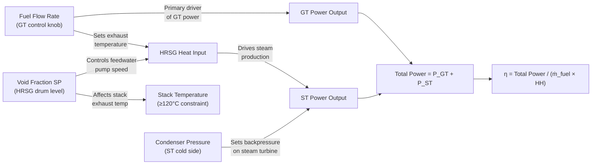
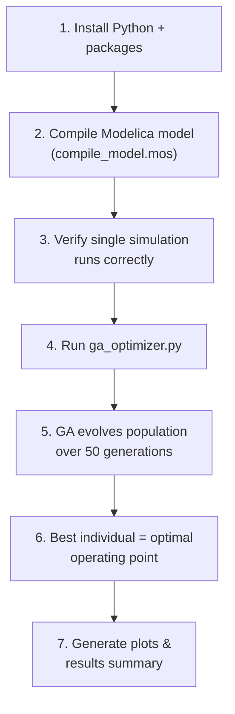

# GA Optimization of 500 MW Open-Loop CCGT Thermal Efficiency

## Goal

Use a **Genetic Algorithm (GA)** to find the combination of 3 operator-adjustable parameters that **maximizes the thermal efficiency** of the `OpenLoopCombineCycle_500MW` model, defined as:

```
η_thermal = (P_GT + P_ST) / (ṁ_fuel × HH)
```

Where `HH = 47.1 MJ/kg` (natural gas heating value from `CombustionChamber1.HH`).

---

## User Review Required

> [!IMPORTANT]
> **Which 500 MW model should we target?**
> There are two 500 MW open-loop models in `CombineCycle.mo`:
> 1. `OpenLoopCombineCycle_500MW` (line 768) — generic ×3 scaled model
> 2. `OpenLoopCombineCycle_M701F_500MW` (line 973) — M701F-based, ×2.8 scaling, 2:1 GT:ST split
>
> Your previous work focused on the M701F variant. **Which model do you want to optimize?** The plan below can work for either — only the model name and default parameter values change.

> [!WARNING]
> **Python is not currently installed on your system.**
> We need Python 3.x with `OMPython` (OpenModelica's official Python API) and `DEAP` (GA framework) to build the optimizer. The plan includes installing Python and these packages. If you prefer a different approach (e.g., MATLAB, pure OMC scripting), let me know.

> [!IMPORTANT]
> **Steady-state vs. transient optimization:**
> Since your model initializes at steady state (`initOpt = steadyState`), the plan optimizes the **steady-state thermal efficiency** for each parameter combination. We remove the fuel step (set `height=0`) and run a short 10-second simulation to capture the converged operating point. Is this the intent, or do you want to optimize efficiency over the full transient (including the fuel ramp)?

---

## Recommended Operator-Adjustable Parameters (3 Parameters)

After analyzing your model, these are the **3 best starting parameters** — they are all genuinely operator-controllable from a real plant control room, span both the GT and ST sides, and have strong interactions affecting overall thermal efficiency:

### Parameter 1: Fuel Mass Flow Rate (`fuelFlowRateStep.offset`)

| Attribute | Value |
|---|---|
| **Current value** | 19.2 kg/s (500MW model) / 14.5 kg/s (M701F model) |
| **Suggested GA range** | 14.0 – 22.0 kg/s (500MW) / 11.0 – 18.0 kg/s (M701F) |
| **Physical meaning** | Primary fuel injection rate to the combustion chamber |
| **Why it matters** | This is the **#1 control knob** in any gas turbine plant. It directly determines: (a) Turbine Inlet Temperature (TIT), (b) GT power output, (c) exhaust gas temperature entering the HRSG. Higher fuel flow → more power but diminishing efficiency returns due to thermodynamic limits. There is a sweet spot where the combined cycle extracts maximum work per unit fuel. |
| **Modelica path** | `fuelFlowRateStep.offset` |

### Parameter 2: Condenser Pressure (`condenser.p`)

| Attribute | Value |
|---|---|
| **Current value** | 5,390 Pa (≈ 0.054 bar, ~34°C saturation) |
| **Suggested GA range** | 3,500 – 10,000 Pa |
| **Physical meaning** | Steam turbine exhaust / condenser operating pressure |
| **Why it matters** | This represents the **cold-side boundary** of the Rankine cycle. In a real plant, operators control this via cooling water flow rate and cooling tower fan speed. Lower condenser pressure → lower saturation temperature → more enthalpy drop across the steam turbine → higher ST power output. However, going too low risks air ingress, increased auxiliary power for vacuum pumps, and cavitation in the condensate pump. In Malaysian equatorial conditions (32°C ambient), the realistic lower bound is ~3,500 Pa. |
| **Modelica path** | `condenser.p` |

### Parameter 3: Evaporator Void Fraction Setpoint (`voidFractionSetPoint.offset`)

| Attribute | Value |
|---|---|
| **Current value** | 0.20 (20% steam by volume in the drum) |
| **Suggested GA range** | 0.10 – 0.50 |
| **Physical meaning** | Target ratio of steam volume to total drum volume in the evaporator |
| **Why it matters** | This controls how aggressively the feedwater pump drives water through the HRSG. A lower setpoint (more liquid) means the pump pushes more cold feedwater into the economizer, cooling the exhaust gas stack temperature further and recovering more heat — but risks flooding the drum and sending wet steam to the superheater. A higher setpoint (more steam) reduces pump work but wastes recoverable heat up the stack. The GA can find the sweet spot that maximizes net ST power while respecting the acid dew-point constraint (~120°C stack minimum). |
| **Modelica path** | `voidFractionSetPoint.offset` |

### Parameter Interaction Map



---

## Architecture Overview

```
┌─────────────────────────────────────────────────────┐
│                 Python GA Optimizer                  │
│  ┌───────────┐  ┌──────────┐  ┌──────────────────┐  │
│  │   DEAP    │  │ Fitness  │  │  Results Parser  │  │
│  │ GA Engine │→ │ Evaluator│→ │  (CSV reader)    │  │
│  └───────────┘  └──────────┘  └──────────────────┘  │
│        ↑              │              ↑               │
│        │              ↓              │               │
│        │     ┌────────────────┐      │               │
│        └─────│  OMC Subprocess│──────┘               │
│              │  (-override)   │                      │
│              └────────────────┘                      │
└─────────────────────────────────────────────────────┘
                       │
                       ↓
         ┌──────────────────────────┐
         │   OpenModelica 1.26.3    │
         │  ┌────────────────────┐  │
         │  │  Compiled Model    │  │
         │  │  (.exe, one-time)  │  │
         │  └────────────────────┘  │
         │  ┌────────────────────┐  │
         │  │  ThermoPower Lib   │  │
         │  └────────────────────┘  │
         └──────────────────────────┘
```

**Key design decision:** We **compile the Modelica model once** into a standalone executable, then call it repeatedly with `-override` flags for each GA individual. This avoids re-compilation (~30-60s each) and reduces each simulation to ~2-5 seconds.

---

## Proposed Changes

### Environment Setup

#### [NEW] Install Python 3.x and dependencies
- Install Python 3.12+ from python.org
- Install packages: `OMPython`, `deap`, `numpy`, `matplotlib`, `pandas`

---

### Compilation Script

#### [NEW] [compile_model.mos](file:///c:/Users/user/OneDrive/Documents/CCGT_OpenModelica-main%20-%20Copy/CCGT_OpenModelica-main%20-%20Copy/ga_optimization/compile_model.mos)

OpenModelica script to compile the CCGT model into a standalone executable (run once):
- Loads the ThermoPower library from the workspace
- Builds the `OpenLoopCombineCycle_500MW` model
- Produces `OpenLoopCombineCycle_500MW.exe` + supporting files

---

### GA Optimizer

#### [NEW] [ga_optimizer.py](file:///c:/Users/user/OneDrive/Documents/CCGT_OpenModelica-main%20-%20Copy/CCGT_OpenModelica-main%20-%20Copy/ga_optimization/ga_optimizer.py)

Main Python script containing:

1. **Configuration section** — parameter names, ranges, GA hyperparameters
2. **`simulate(params)` function** — calls the compiled model executable with `-override` flags, parses the output CSV, returns `(P_GT, P_ST, fuel_flow)`
3. **`fitness(individual)` function** — calculates thermal efficiency + applies penalty for constraint violations (e.g., stack temp < 120°C, TIT > 1600 K)
4. **GA setup using DEAP** — tournament selection, blend crossover (BLX-α), Gaussian mutation
5. **Results logging** — saves every generation's best/avg/worst fitness to CSV
6. **Convergence plot** — matplotlib visualization of efficiency vs. generation

**GA Hyperparameters (starting values):**

| Parameter | Value | Rationale |
|---|---|---|
| Population size | 30 | Small enough for fast iterations, large enough for diversity |
| Generations | 50 | Sufficient for 3-parameter search space |
| Crossover probability | 0.7 | Standard BLX-α crossover |
| Mutation probability | 0.2 | Per-gene Gaussian mutation |
| Tournament size | 3 | Moderate selection pressure |
| Elite count | 2 | Preserve best solutions |

**Constraint handling (penalty function):**

| Constraint | Limit | Source |
|---|---|---|
| Stack exhaust temperature | ≥ 120°C (393 K) | Acid dew point (from README) |
| Turbine Inlet Temperature | ≤ 1600 K | Material/blade cooling limit |
| Simulation convergence | Must complete | Infeasible parameter regions |

---

#### [NEW] [plot_results.py](file:///c:/Users/user/OneDrive/Documents/CCGT_OpenModelica-main%20-%20Copy/CCGT_OpenModelica-main%20-%20Copy/ga_optimization/plot_results.py)

Post-processing script to visualize:
- Convergence curve (best/average efficiency vs. generation)
- Parameter evolution across generations
- Pareto-style scatter of efficiency vs. total power
- Optimal operating point summary

---

## Execution Workflow



**Estimated runtime:** ~30 individuals × 50 generations × 3 seconds/sim ≈ **75 minutes** total. Can be reduced by lowering population size or generations.

---

## Open Questions

> [!IMPORTANT]
> 1. **Which model?** `OpenLoopCombineCycle_500MW` or `OpenLoopCombineCycle_M701F_500MW`?
> 2. **Python installation:** Are you OK with installing Python 3.12? Or do you already have it installed elsewhere / prefer Anaconda?
> 3. **Do you agree with these 3 parameters?** Some alternatives to consider:
>    - **HRSG steam pressure** (`fluidNomPressure` on economizer/evaporator/superheater) — this is more of a design parameter than operator-adjustable, but could be included if you're doing design optimization rather than operational optimization
>    - **Ambient temperature** (`SourceP1.T`) — if you want to study efficiency sensitivity to Malaysian weather conditions
> 4. **Constraints:** Are the stack temp ≥ 120°C and TIT ≤ 1600 K constraints correct for your plant? Any others?

---

## Verification Plan

### Automated Tests
1. **Compile test:** Run `compile_model.mos` and verify the executable is produced
2. **Single-sim test:** Run one simulation with default parameters via `-override`, verify CSV output contains `generatedPower_GT` and `generatedPower_ST`
3. **Efficiency sanity check:** Verify baseline efficiency matches README (~48-50% combined cycle)
4. **GA convergence:** Verify the GA converges (best fitness improves across generations and plateaus)

### Manual Verification
1. **Parameter feasibility:** Verify the GA's optimal parameters produce a physically valid simulation (no negative pressures, no impossible temperatures)
2. **Cross-check in OMEdit:** Load the optimal parameters back into the model in OMEdit GUI and visually inspect the transient response
