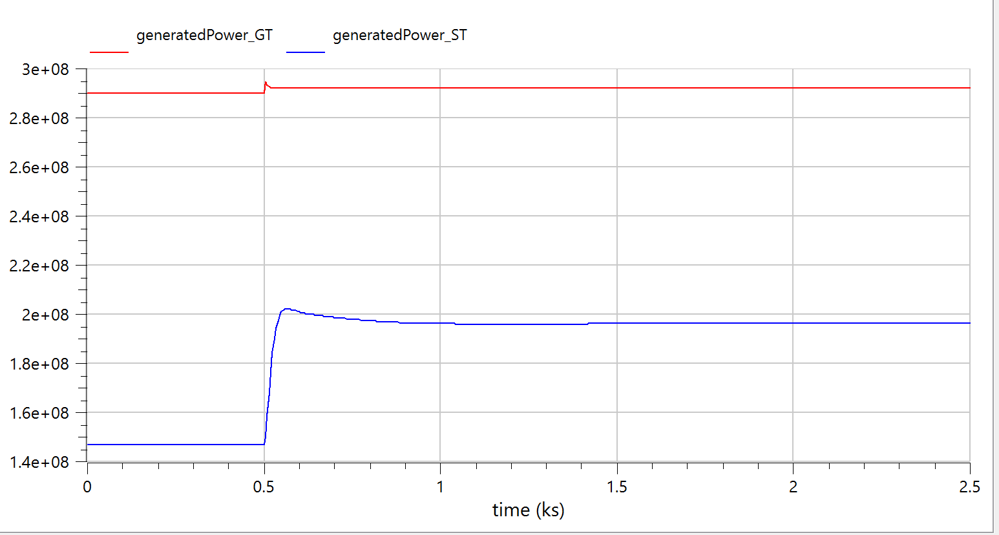
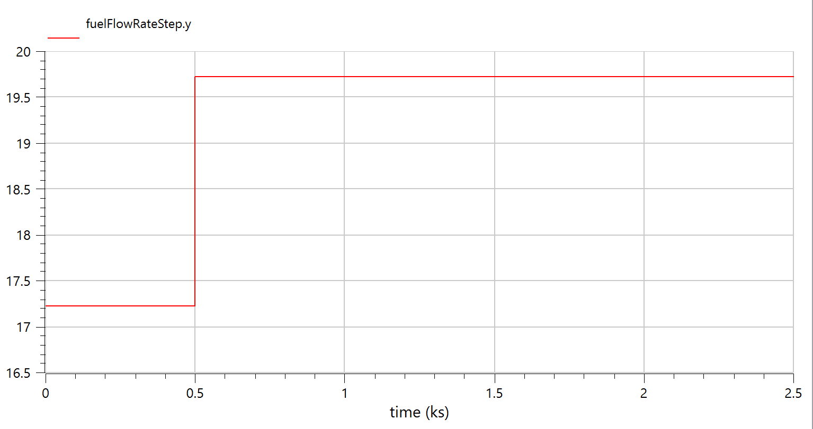
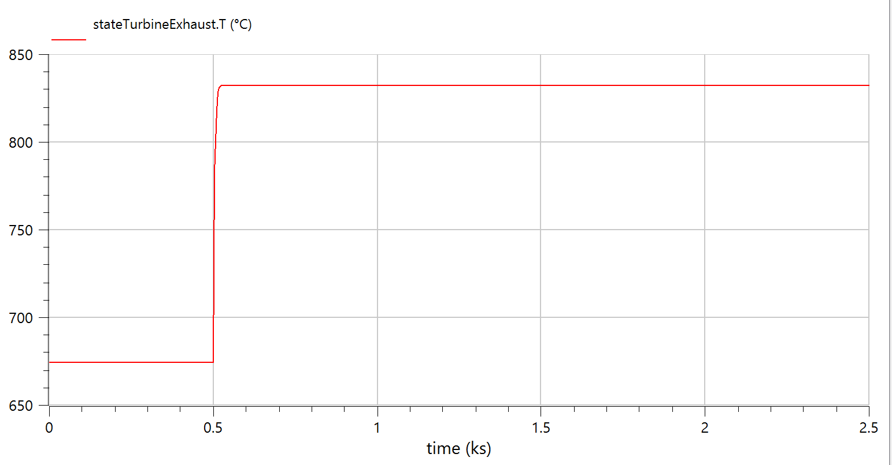
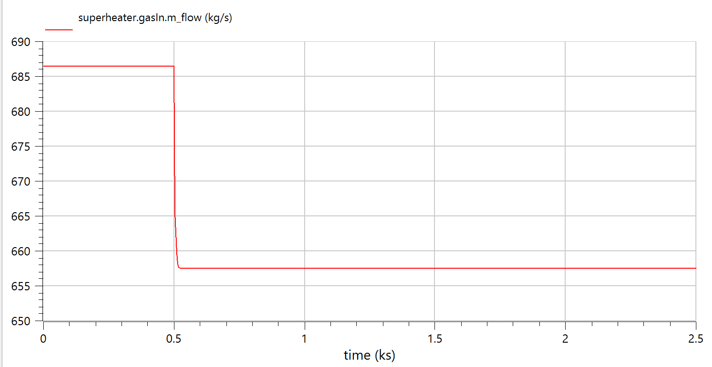
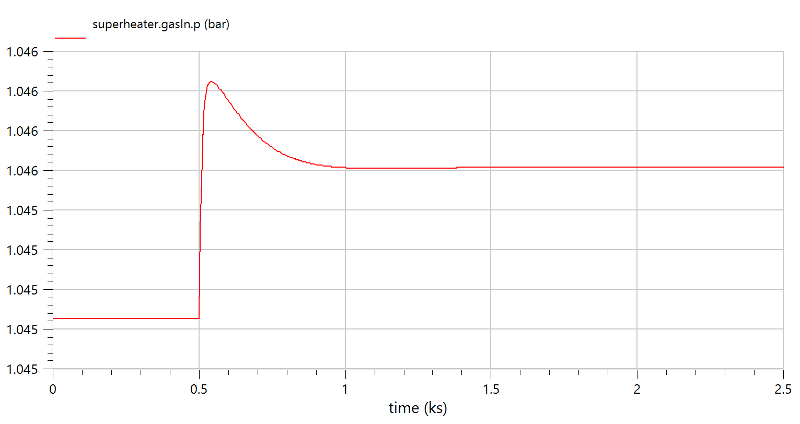
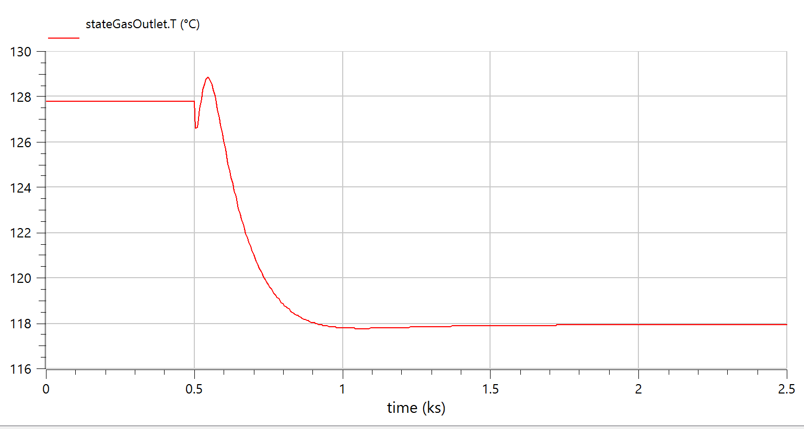
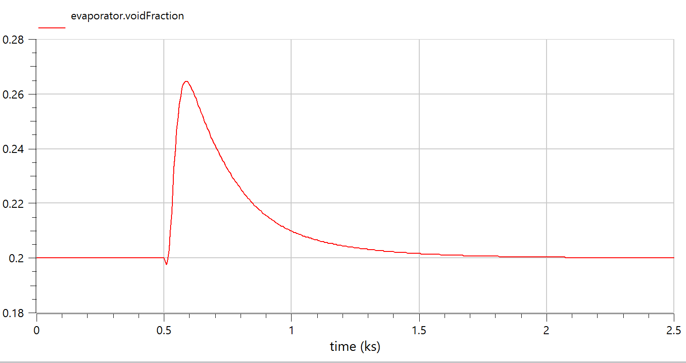
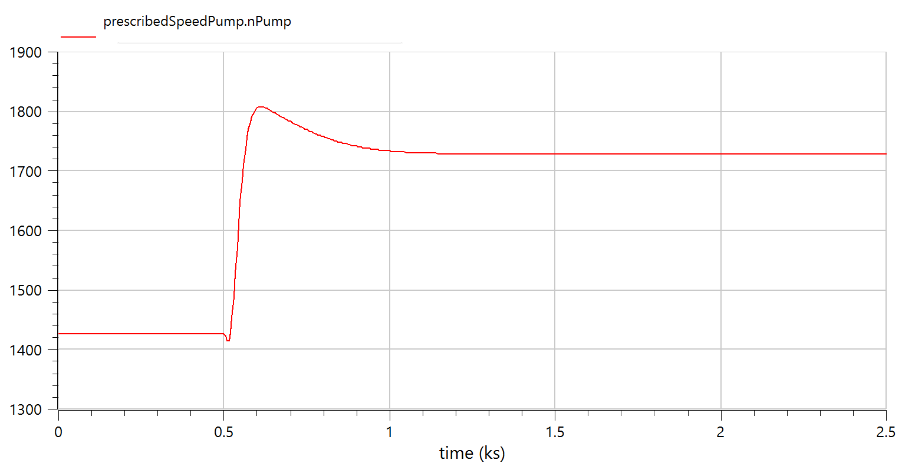

# M701F Open-Loop Simulation Results — ISO vs Tropical Comparison

## 1. Summary

This document compares the `OpenLoopCombineCycle_M701F_ISO` and `OpenLoopCombineCycle_M701F` simulation results after applying the `Tdes_in` correction (compressor designed at ISO 288.15 K). Both models use identical fuel flow (17.22 kg/s steady-state, stepping to 19.72 kg/s at t=500s) and identical HRSG/ST configurations.

### Key Change
```
Compressor Tdes_in = 288.15 K (ISO design temperature) in BOTH models
- ISO model: T_inlet = 288.15 K → N_corrected = 100% (design point)
- Tropical model: T_inlet = 305.15 K → N_corrected = 97.2% (off-design)
```

---

## 2. Steady-State Performance Comparison (After Fuel Step, t > 1000s)

| Parameter | ISO (15°C) | Tropical (32°C) | Difference | % Change |
|---|:---:|:---:|:---:|:---:|
| Ambient Temperature | 288.15 K (15°C) | 305.15 K (32°C) | +17°C | — |
| Compressor Corrected Speed | 100% | 97.2% | −2.8% | Off-design |
| **GT Power** | **337 MW** | **292 MW** | **−45 MW** | **−13.4%** |
| **ST Power** | **161 MW** | **196 MW** | **+35 MW** | **+21.7%** |
| **Total CC Power** | **498 MW** | **488 MW** | **−10 MW** | **−2.0%** |
| GT:ST Ratio | 2.09:1 | 1.49:1 | — | Shifted |
| Fuel Flow | 19.72 kg/s | 19.72 kg/s | 0 | Same |
| Fuel Heat Input | 928.8 MW | 928.8 MW | 0 | Same |
| **CC Efficiency (η)** | **53.6%** | **52.5%** | **−1.1 pp** | — |
| Heat Rate | 6,716 kJ/kWh | 6,854 kJ/kWh | +138 | +2.1% |

---

## 3. Simulation Plots — Side-by-Side Comparison

### 3.1 GT and ST Power Output

**ISO (15°C)**


**Tropical (32°C)**


**Observations:**
- ISO: GT settles at ~337 MW (red), ST at ~161 MW (blue) after fuel step
- Tropical: GT settles at ~292 MW (red), ST at ~196 MW (blue) after fuel step
- GT drops 45 MW at tropical due to off-design compressor operation
- ST rises 35 MW at tropical due to hotter exhaust gas → more HRSG heat recovery
- GT response is near-instantaneous; ST has ~200s thermal lag

---

### 3.2 Fuel Flow Rate

**ISO (15°C)**


**Tropical (32°C)**


**Observations:**
- Both models use identical fuel schedule: 17.22 kg/s → 19.72 kg/s step at t=500s
- Confirms like-for-like comparison (same fuel input, different ambient conditions)

---

### 3.3 Turbine Exhaust Temperature

**ISO (15°C)**


**Tropical (32°C)**


**Observations:**
- ISO: Exhaust temperature lower (higher PR → more expansion → more energy extracted by GT)
- Tropical: Exhaust temperature higher (lower PR → less expansion → more residual heat to HRSG)
- This explains why ST power increases at tropical conditions despite GT power decreasing

---

### 3.4 HRSG Gas Inlet Mass Flow (Superheater)

**ISO (15°C)**


**Tropical (32°C)**


**Observations:**
- ISO: Higher exhaust mass flow (denser air → more compressor mass flow)
- Tropical: Lower exhaust mass flow (less dense air at 32°C)
- Despite lower mass flow at tropical, the higher exhaust temperature delivers more total heat to the HRSG

---

### 3.5 HRSG Gas Inlet Pressure (Superheater)

**ISO (15°C)**


**Tropical (32°C)**


**Observations:**
- Both models show exhaust gas pressure near atmospheric (~1.015 bar)
- HRSG pressure drop is minimal (gas side vents to atmosphere)
- No significant difference between ISO and tropical

---

### 3.6 Stack Exhaust Temperature (Gas Outlet)

**ISO (15°C)**


**Tropical (32°C)**


**Observations:**
- Both models show stack temperature well above acid dew point (120°C / 393 K)
- Tropical stack temperature may be slightly higher (more heat entering HRSG, but also higher pinch constraints)

---

### 3.7 Evaporator Void Fraction

**ISO (15°C)**


**Tropical (32°C)**


**Observations:**
- Both models maintain void fraction near setpoint (0.2) via PID-controlled pump speed
- Stable drum level control in both conditions
- Slight transient during fuel step (t=500s), settles within ~200s

---

### 3.8 Feedwater Pump Speed

**ISO (15°C)**


**Tropical (32°C)**


**Observations:**
- Pump speed increases after fuel step to maintain drum level as steam production rises
- Tropical pump speed may be higher due to greater steam production (more heat recovery)
- PID controller (Kp=−2, Ti=300) successfully tracks setpoint in both cases

---

## 4. Physical Interpretation of Derating

### Why GT Power Drops at Tropical Conditions
1. **Off-design compressor**: At 32°C, corrected speed drops to 97.2% → operating point shifts down the compressor map
2. **Lower pressure ratio**: Compressor delivers less PR at off-design → less pressure energy available for turbine
3. **Higher specific compressor work**: Warmer air requires more energy per kg to compress
4. **Net effect**: GT shaft power = (Turbine work − Compressor work) decreases by 13.4%

### Why ST Power Rises at Tropical Conditions
1. **Lower GT expansion**: Less energy extracted by gas turbine → exhaust gas is hotter
2. **Higher HRSG driving temperature**: Hotter exhaust → larger ΔT across heat exchangers
3. **More steam produced**: More heat transferred to water/steam side
4. **Net effect**: ST power increases by 21.7%

### Why Net CC Derating is Only 2%
- The HRSG acts as a **thermal buffer** that partially compensates GT derating
- This is characteristic of single-pressure CCGT configurations
- Real plants see 3-5% net CC derating (model slightly under-predicts due to simplified HRSG)

---

## 5. Efficiency Analysis

| Metric | Formula | ISO | Tropical |
|---|---|:---:|:---:|
| Fuel heat input | Q = ṁ_fuel × LHV | 928.8 MW | 928.8 MW |
| Total CC power | P = P_GT + P_ST | 498 MW | 488 MW |
| CC efficiency | η = P / Q × 100% | 53.6% | 52.5% |
| Heat rate | HR = 3600 / η | 6,716 kJ/kWh | 6,854 kJ/kWh |
| GT standalone η | η_GT = P_GT / Q | 36.3% | 31.4% |
| Bottoming cycle ratio | P_ST / P_GT | 0.48 | 0.67 |

---

## 6. Comparison with Industry Data

| Metric | Model (Tropical) | Typical M701F (Tropical) | Assessment |
|---|:---:|:---:|---|
| GT derating per °C | 0.79%/°C | 0.5-0.7%/°C | Slightly aggressive |
| Net CC derating (17°C) | 2.0% | 3-5% | Under-predicted |
| GT:ST ratio at tropical | 1.49:1 | 1.7-1.9:1 | ST compensation over-estimated |
| CC efficiency (tropical) | 52.5% | 50-55% | Within expected range |

> **Note**: The model over-estimates ST compensation because it uses a simplified single-pressure HRSG without modelling turbine cooling air extraction (which would reduce exhaust energy available to the HRSG). This is documented as a known limitation.
