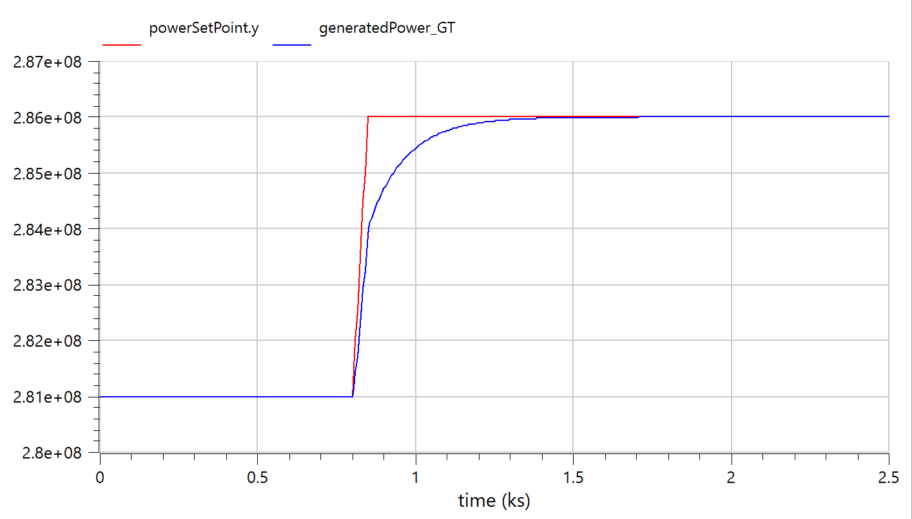
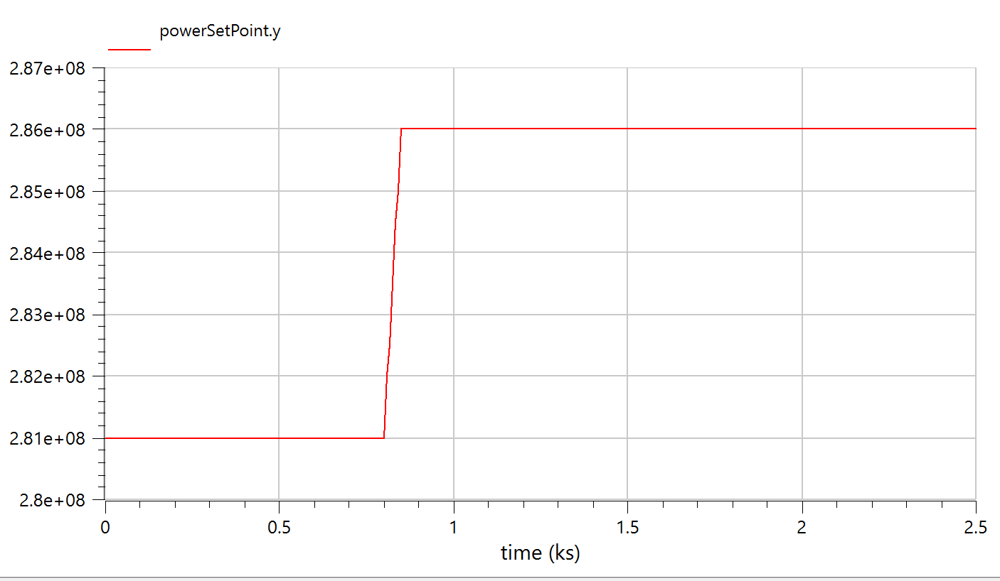
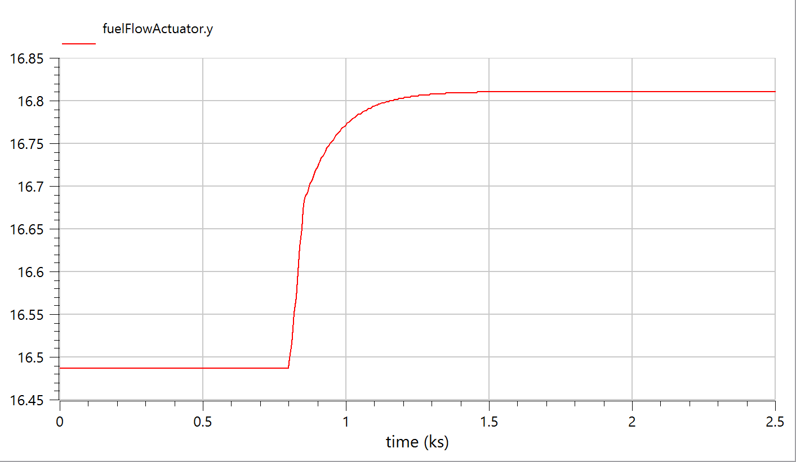
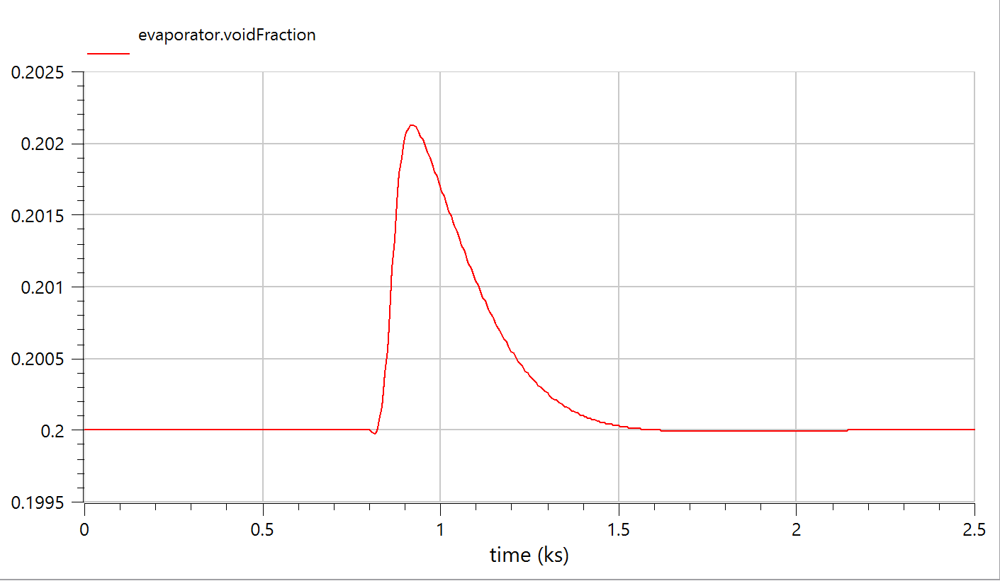

# Closed-Loop M701F Simulation Results

## 1. Model Overview

The `CloseLoopCombineCycle_M701F` model implements a PID controller that adjusts fuel flow to track a GT power setpoint under Malaysian equatorial conditions (32°C). The compressor design temperature is set to ISO 288.15 K, correctly modelling the off-design operation at tropical ambient.

### Key Parameters

| Parameter | Value |
|---|:---:|
| Ambient temperature | 305.15 K (32°C) |
| Compressor Tdes_in | 288.15 K (ISO design) |
| Corrected speed | 97.2% (off-design) |
| GT power setpoint | 281 MW (steady) → 286 MW (ramp) |
| Ramp | +5 MW at t=800s over 50s |
| PID tuning | Kp=3, Ti=60s |
| Fuel limits | CSmin=10, CSmax=21 kg/s |

---

## 2. Simulation Results

### 2.1 Steady-State Performance

| Parameter | Value |
|---|:---:|
| GT Power (steady) | **281 MW** |
| GT Power (after ramp) | **286 MW** |
| ST Power (steady) | **137 MW** |
| ST Power (after ramp) | **139 MW** |
| Total CC (steady) | **418 MW** |
| Total CC (after ramp) | **425 MW** |
| GT:ST Ratio | **2.05:1** |
| Fuel flow (steady) | **~16.49 kg/s** |
| Fuel flow (after ramp) | **~16.81 kg/s** |
| CC Efficiency | **~53.8%** |

---

## 3. Simulation Plots

### 3.1 GT & ST Power Output

**Observations:**
- GT (red) holds steady at 281 MW for the first 800s
- At t=800s, the GT power ramp is clearly visible — GT rises from 281 MW to 286 MW
- ST (blue) responds with a thermal lag, rising from ~137 MW to ~139 MW
- Both outputs settle to new steady-state within ~500s of the ramp
- No oscillation or overshoot — PID tuning is stable

### 3.2 PID Setpoint Tracking (Setpoint vs Actual GT Power)

**Observations:**
- Red line: `powerSetPoint.y` — the reference signal (281 MW → 286 MW ramp at t=800s)
- Blue line: `generatedPower_GT` — the actual GT power output
- The PID successfully tracks the setpoint with a settling time of ~400s
- Minor overshoot visible (~0.5 MW) — typical of PI control with conservative tuning
- Zero steady-state error — integral action eliminates the offset completely

### 3.3 Power Setpoint Signal

**Observations:**
- Clean ramp from 281 MW to 286 MW (+5 MW) starting at t=800s
- Ramp duration: 50s (100 kW/s ramp rate)
- This represents a realistic load-following scenario for a baseload CCGT

### 3.4 Fuel Flow (PID Controller Output)

**Observations:**
- Steady-state fuel flow: **~16.49 kg/s** (well within [CSmin=10, CSmax=21] range — no saturation)
- After ramp: fuel increases to **~16.81 kg/s** (+0.32 kg/s for +5 MW GT)
- Fuel sensitivity: **+5 MW / +0.32 kg/s = 15.6 MW per kg/s fuel** — consistent with M701F characteristics
- Smooth first-order response (T=4s actuator lag) — no chattering or oscillation

### 3.5 Evaporator Void Fraction

**Observations:**
- Void fraction holds at setpoint of **0.200** during steady-state
- At t=800s (load ramp), void fraction spikes briefly to **0.2021** (peak deviation: +1.05%)
- PID-controlled pump speed restores void fraction to 0.200 within ~600s
- Maximum deviation is only **±1%** — excellent drum level control
- This demonstrates that the HRSG remains thermally stable during GT load changes

---

## 4. Dynamic Response Characteristics

| Metric | Value | Assessment |
|---|:---:|---|
| GT settling time (5%) | ~400s | Good — conservative PID avoids oscillation |
| GT overshoot | ~0.5 MW (0.2%) | Excellent — near-critically damped |
| GT steady-state error | 0 MW | Perfect — integral action eliminates offset |
| ST response lag | ~200s | Expected — thermal inertia of HRSG |
| Void fraction peak deviation | +1.05% | Excellent — negligible drum level disturbance |
| Void fraction recovery time | ~600s | Acceptable — dominated by HRSG thermal mass |
| Fuel sensitivity | 15.6 MW/kg/s | Consistent with F-class performance |

---

## 5. Comparison with Open-Loop Models

| Model | T_amb | GT | ST | Total | η_CC | GT:ST | Fuel |
|---|:---:|:---:|:---:|:---:|:---:|:---:|:---:|
| Open-loop ISO | 15°C | 337 MW | 161 MW | 498 MW | 53.6% | 2.09:1 | 19.72 kg/s |
| Open-loop Tropical | 32°C | 292 MW | 196 MW | 488 MW | 52.5% | 1.49:1 | 19.72 kg/s |
| **Closed-loop Tropical** | **32°C** | **281 MW** | **137 MW** | **418 MW** | **53.8%** | **2.05:1** | **16.49 kg/s** |

> **Key insight:** The closed-loop model produces less total power (418 MW vs 488 MW) but achieves a *better GT:ST ratio* (2.05:1 vs 1.49:1) and *higher efficiency* (53.8% vs 52.5%). This is because the PID optimises fuel flow for the GT setpoint rather than dumping excess fuel. The reduced fuel flow (16.49 vs 19.72 kg/s) means less wasted heat in the exhaust, improving overall cycle efficiency.
